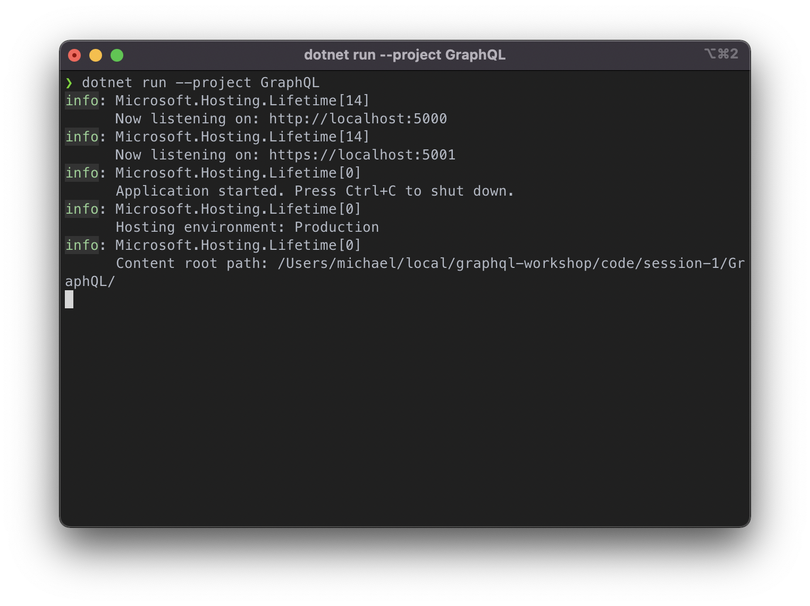
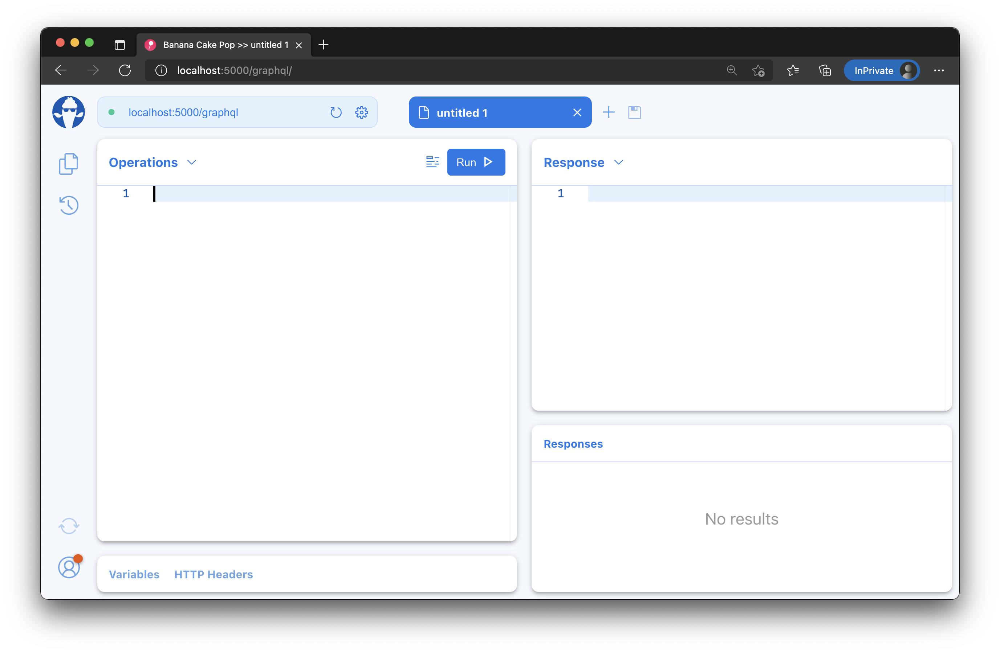
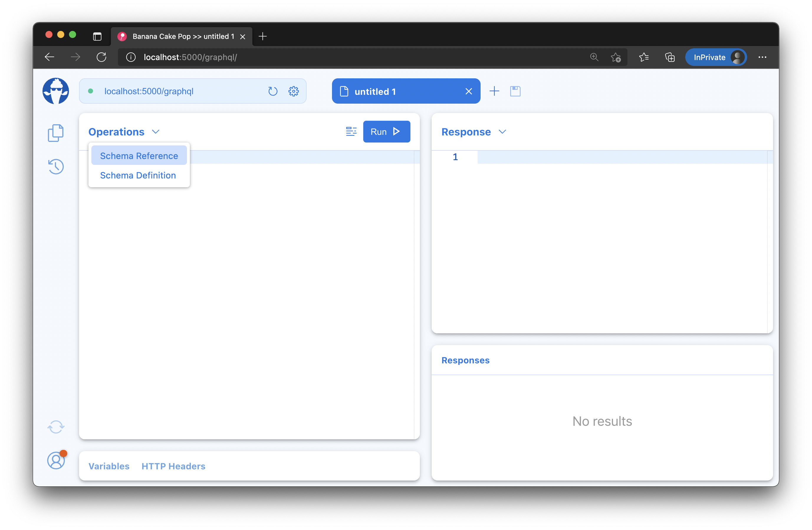
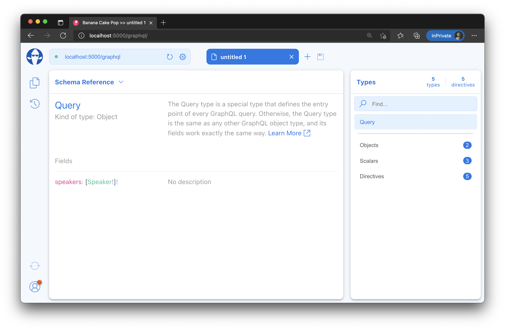
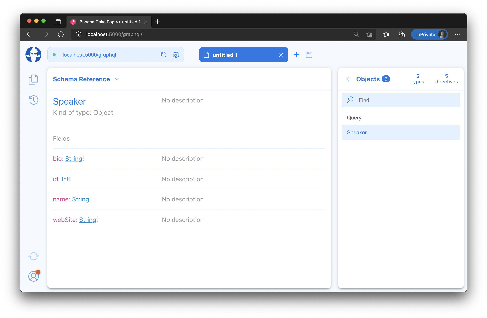
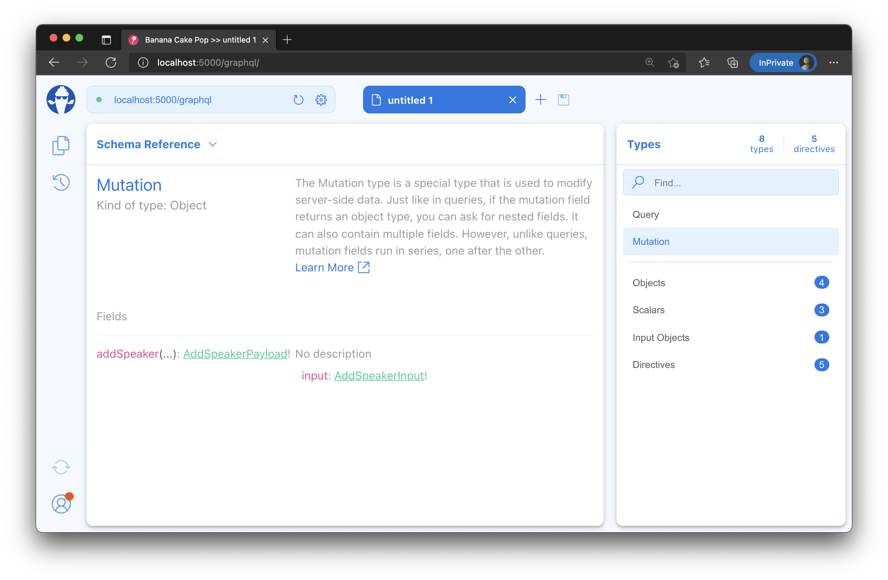
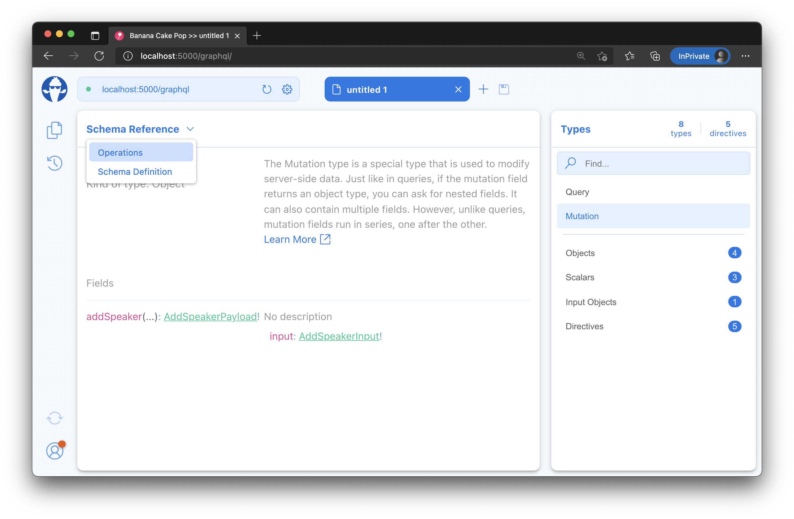
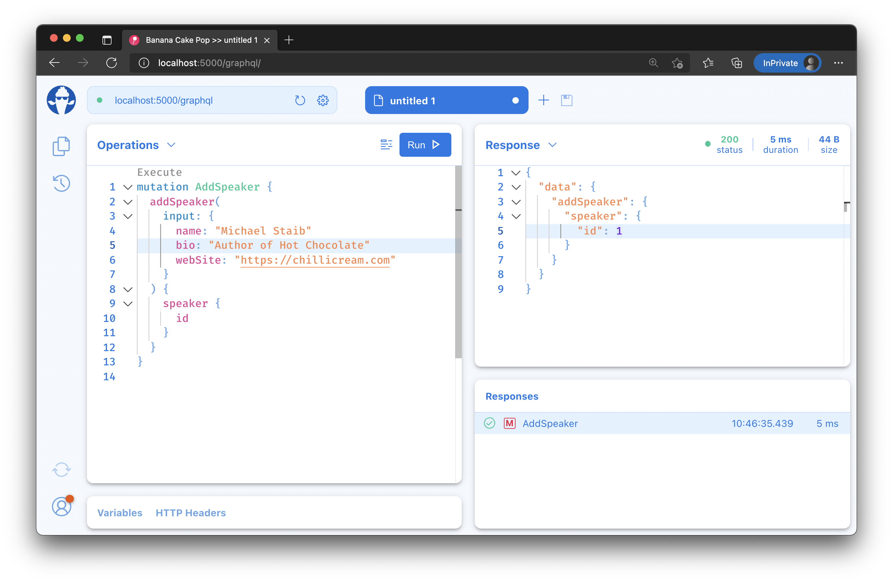
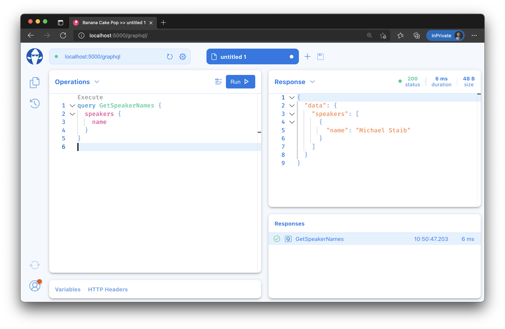

- [Create a new GraphQL server project](#create-a-new-graphql-server-project)
  - [Register the DB Context Service](#register-the-db-context-service)
  - [Configuring EF Migrations](#configuring-ef-migrations)
    - [Option 1 - Visual Studio: Package Manager Console](#option-1---visual-studio-package-manager-console)
    - [Option 2 - Command line](#option-2---command-line)
  - [Adding GraphQL](#adding-graphql)
  - [Adding Mutations](#adding-mutations)
  - [Summary](#summary)

# Create a new GraphQL server project

1. Make sure that you have installed .NET 6 SDK before you start. In order to download and install the SDK head over to https://dot.net
1. Next install the Hot Chocolate templates
   1. `dotnet new -i HotChocolate.Templates`
1. Create a new project for our GraphQL Server.
   1. `dotnet new sln -n ConferencePlanner`
   1. `dotnet new graphql -n GraphQL`
   1. `dotnet sln add GraphQL`
1. Add a new folder `Data` where we want to place all our database related code.
   1. `mkdir GraphQL/Data`
1. Add a new file `Speaker.cs` in the `Data` directory using the following code:

   ```csharp
   using System.ComponentModel.DataAnnotations;

   namespace ConferencePlanner.GraphQL.Data;

   public class Speaker
   {
       public int Id { get; set; }

       [Required]
       [StringLength(200)]
       public string? Name { get; set; }

       [StringLength(4000)]
       public string? Bio { get; set; }

       [StringLength(1000)]
       public string? WebSite { get; set; }
   }
   ```

1. Add a reference to the NuGet package package `Microsoft.EntityFrameworkCore.Sqlite` version `6.0.0`.
   1. `dotnet add GraphQL package Microsoft.EntityFrameworkCore.Sqlite --version 6.0.0`
1. Next we'll create a new Entity Framework DbContext. Create a new `ApplicationDbContext` class in the `Data` folder using the following code:

   ```csharp
   using Microsoft.EntityFrameworkCore;

   namespace ConferencePlanner.GraphQL.Data;

   public class ApplicationDbContext : DbContext
   {
       public ApplicationDbContext(DbContextOptions<ApplicationDbContext> options)
           : base(options)
       {
       }

       public DbSet<Speaker> Speakers => Set<Speaker>();
   }
   ```

## Register the DB Context Service

1. Add the following code to the `Program.cs` just after the line `var builder = WebApplication.CreateBuilder(args);`:

   ```csharp
   builder.Services
       .AddDbContext<ApplicationDbContext>(
           options => options.UseSqlite("Data Source=conferences.db"));
   ```

   The file should no look like the following:

   ```csharp
   using ConferencePlanner.GraphQL.Data;
   using Microsoft.EntityFrameworkCore;

   var builder = WebApplication.CreateBuilder(args);

   builder.Services
       .AddDbContext<ApplicationDbContext>(
           options => options.UseSqlite("Data Source=conferences.db"));

   builder.Services
       .AddGraphQLServer()
       .AddQueryType<Query>();

   var app = builder.Build();

   app.MapGraphQL();

   app.Run();
   ```

   > This code registers the `ApplicationDbContext` service so it can be injected into resolvers.

## Configuring EF Migrations

1. Add a reference to the NuGet package `Microsoft.EntityFrameworkCore.Tools` version `6.0.0`.
   1. `dotnet add GraphQL package Microsoft.EntityFrameworkCore.Tools --version 6.0.0`

### Option 1 - Visual Studio: Package Manager Console

1. In Visual Studio, select the Tools -> NuGet Package Manager -> Package Manager Console

1. Run the following commands in the Package Manager Console

   ```console
   Add-Migration Initial
   Update-Database
   ```

### Option 2 - Command line

1. Install the EntityFramework global tool `dotnet-ef` using the following command:

   ```console
   dotnet new tool-manifest
   dotnet tool install dotnet-ef --version 6.0.0 --local
   ```

2. Open a command prompt and navigate to the project directory. (The directory containing the `Startup.cs` file).

3. Run the following commands in the command prompt:

   ```console
   dotnet build GraphQL
   dotnet ef migrations add Initial --project GraphQL
   dotnet ef database update --project GraphQL
   ```

Commands Explained

| Command                                                      | Description                                                                                                                                             |
| ------------------------------------------------------------ | ------------------------------------------------------------------------------------------------------------------------------------------------------- |
| `dotnet ef migrations add Initial` / `Add-Migration Initial` | generates code to create the initial database schema based on the model specified in 'ApplicationDbContext.cs'. `Initial` is the name of the migration. |
| `dotnet ef database update` / `Update-Database`              | creates the database                                                                                                                                    |

> If your database ever gets in a bad state and you'd like to reset things, you can use `dotnet ef database drop` followed by `dotnet ef database update` to remove your database and run all migrations again.

## Adding GraphQL

Since we used the GraphQL template we already have a basic GraphQL server. In order to query our data we need to replace the `Query` class with our own implementation. Also, since we are using EF core we need to add the `HotChocolate.Data.EntityFramework` package to get the EF core integrations for Hot Chocolate.

1. Add a reference to the NuGet package package `HotChocolate.Data.EntityFramework` version `12.4.0`.
   1. `dotnet add GraphQL package HotChocolate.Data.EntityFramework --version 12.4.0`
2. Next we'll replace the query root type (`Query.cs`) and add a resolver that fetches all of our speakers.

   ```csharp
   using ConferencePlanner.GraphQL.Data;

   namespace ConferencePlanner.GraphQL;

   public class Query
   {
       public IQueryable<Speaker> GetSpeakers(ApplicationDbContext context)
          => context.Speakers;
   }
   ```

3. Before we can do anything with our query root type we need to register our `ApplicationDbContext` with the schema so that the execution engine knows how to use this service. For this head to the `Program.cs` and chain in `.RegisterDbContext<ApplicationDbContext>()` right after `.AddQueryType<Query>()`:

   ```csharp
   builder.Services
      .AddGraphQLServer()
      .AddQueryType<Query>()
      .RegisterDbContext<ApplicationDbContext>();
   ```

   > The above code registers a GraphQL server with our dependency injection and declares the `Query` class as the GraphQL query root type. We also registered our `ApplicationDbContext` as a well-known DBContext with our schema.

   We now have a GraphQL server that should allow us to fetch speakers from our database through GraphQL.

4. Start the server.

   1. `dotnet run --project GraphQL`

   

5. Start [Banana Cakepop](https://chillicream.com/docs/bananacakepop) or use it built-in your browser at [http://localhost:5000/graphql/](http://localhost:5000/graphql/) and connect to our server (usually at [http://localhost:5000/graphql](http://localhost:5000/graphql)).

   

   After you have connected to Banana Cakepop, hit `Enter` to open a new tab.

   

6. Click on the operation drop down and select **Schema Reference**. Next, click on the return type of the `speakers` field in order to explore the return type.  
   **Note**: You might have to reload the schema, you can do so by clicking the refresh-button in the upper-right corner.

   

   

   

## Adding Mutations

So, far we have added the Query root type to our schema, which allows us to query speakers. However, there is no way to add or modify any data at this point. In this section, we will add the root Mutation type to add new speakers to our database.

> For mutations we are using the [relay mutation pattern](https://relay.dev/docs/v9.1.0/graphql-server-specification/#mutations) which is commonly used in GraphQL.

A mutation consists of three components, the **input**, the **payload** and the **mutation** itself. In our case we want to create a mutation called `addSpeaker`, by convention, mutations are named as verbs, their inputs are the name with "Input" appended at the end, and they return an object that is the name with "Payload" appended.

So, for our `addSpeaker` mutation, we create two types: `AddSpeakerInput` and `AddSpeakerPayload`. Hot Chocolate supports this pattern out of the box and we do not really need to add these payload and input types. In order to opt into this pattern we just need to chain in `AddMutationConventions()` after `AddQueryType<Query>()`.

1. Head over to the `Program.cs` and add `AddMutationConventions()`

2. Now, lets add the actual mutation type with our `addSpeaker` mutation in it.

   ```csharp
   using ConferencePlanner.GraphQL.Data;

   namespace ConferencePlanner.GraphQL;
   
   public class Mutation
   {
       public async Task<Speaker> AddSpeakerAsync(
           string name,
           string? bio,
           string? webSite,
           [Service] ApplicationDbContext context)
       {
           var speaker = new Speaker
           {
               Name = name,
               Bio = bio,
               WebSite = webSite
           };
           context.Speakers.Add(speaker);
           await context.SaveChangesAsync();
           return speaker;
       }
   }
   ```

3. Last but not least we need to add the new `Mutation` type to your schema:

   ```csharp
   builder.Services
      .AddGraphQLServer()
      .AddQueryType<Query>()
      .AddMutationType<Mutation>()
      .AddMutationConventions()
      .RegisterDbContext<ApplicationDbContext>();
   ```

4. Start the server again in order to validate if it is working properly.

   1. `dotnet run --project GraphQL`

5. Explore with Banana Cakepop the changes schema to the schema. There should now be a mutation type and the `addSpeaker` mutation.
   

6. Now, switch back to the operation editor in Banana Cakepop by clicking on the **Schema Reference** drop down and select **Operations**.

   

7. Next add a speaker by writing a GraphQL mutation. Copy the request below and paste it into the **Operations** window. After that click **Run**.

   ```graphql
   mutation AddSpeaker {
     addSpeaker(
       input: {
         name: "Speaker Name"
         bio: "Speaker Bio"
         webSite: "http://speaker.website"
       }
     ) {
       speaker {
         id
       }
     }
   }
   ```

   

8. Query the names of all the speakers in the database with Banana Cakepop by adding the request below to your document.

   ```graphql
   query GetSpeakerNames {
     speakers {
       name
     }
   }
   ```

   

   > When a GraphQL document has multiple operations you can click on the execute link above the operation name to execute it.

## Summary

In this first session, you have learned how we can create a simple GraphQL project on top of ASP.NET Core.

You have leveraged Entity Framework to create your models and save those to the database.

Together, ASP.NET Core, Entity Framework, and Hot Chocolate let you build a simple GraphQL server in no time.

[**Session #2 - Controlling nullability >>**](2-controlling-nullability.md)
