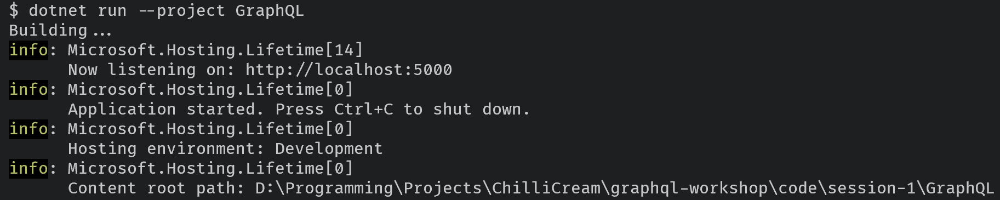
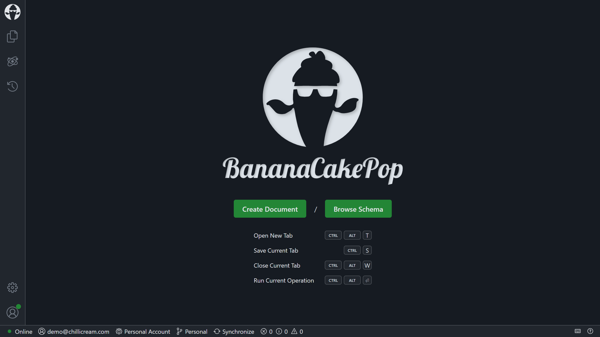
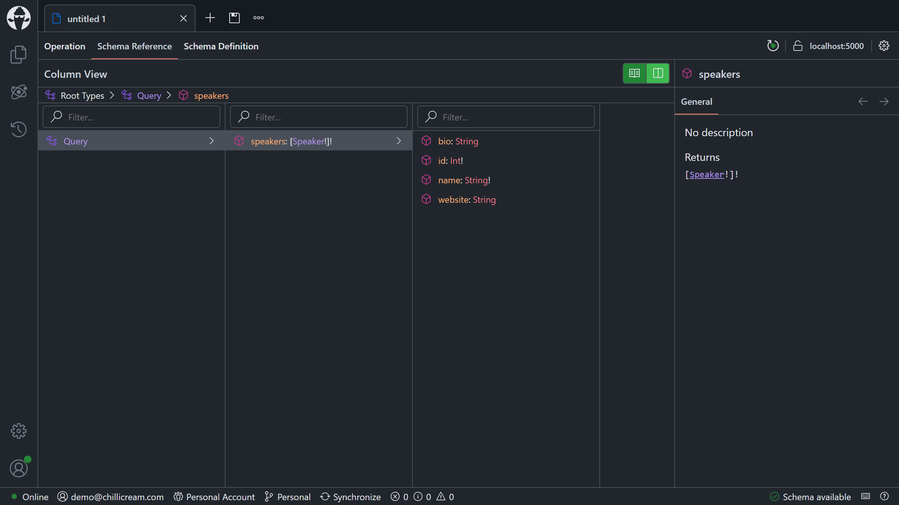
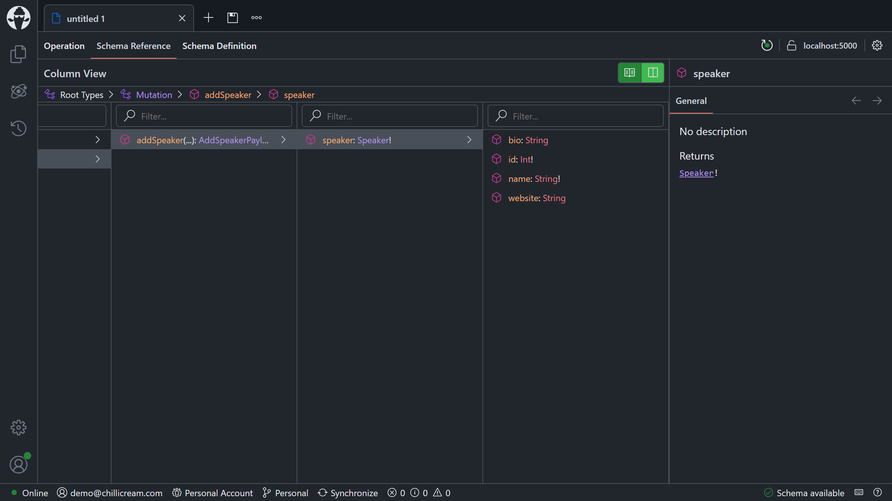
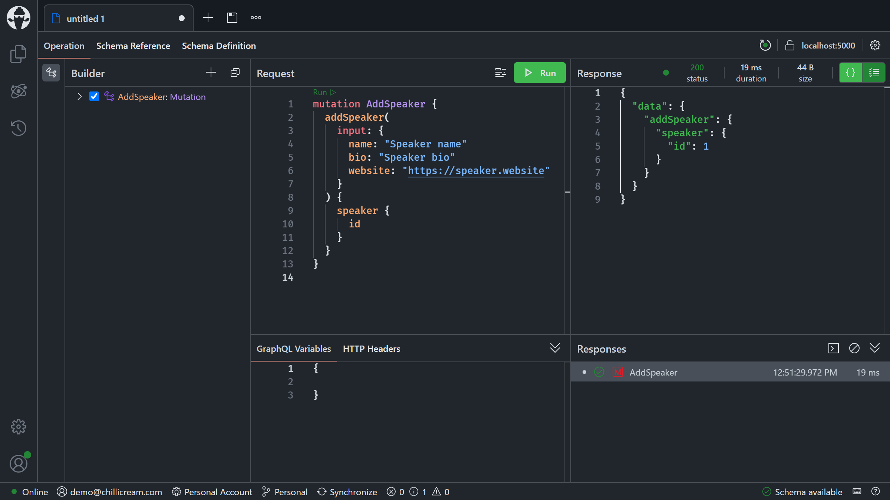
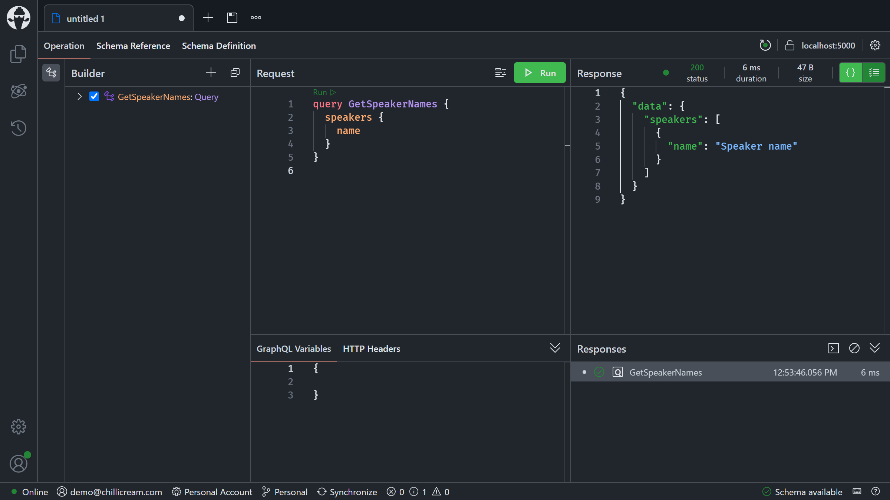

# Creating a new GraphQL server project

- [Registering the DB Context Service](#registering-the-db-context-service)
- [Configuring EF Migrations](#configuring-ef-migrations)
  - [Option 1 - Command line](#option-1---command-line)
  - [Option 2 - Visual Studio: Package Manager Console](#option-2---visual-studio-package-manager-console)
- [Adding GraphQL](#adding-graphql)
- [Adding a Query](#adding-a-query)
- [Adding a Mutation](#adding-a-mutation)
- [Summary](#summary)

1. To begin, create a new project for our GraphQL server:
    - `dotnet new sln --name ConferencePlanner`
    - `dotnet new web --name GraphQL`
    - `dotnet sln add GraphQL`

1. Update the `launchSettings.json` file in the `Properties` directory as follows:
    - Remove the `iisSettings` and the `IIS Express` profile.
    - Change `launchBrowser` to `false` in the `http` and `https` profiles.
    - Change the HTTP port to `5000` and the HTTPS port to `7000`, in the `applicationUrl` properties.

1. Add the following to the `<PropertyGroup>` in `GraphQL.csproj`:

    ```xml
    <RootNamespace>ConferencePlanner.GraphQL</RootNamespace>
    ```

1. Add a new directory named `Data` where we will place all of our database-related code:

    ```shell
    mkdir GraphQL/Data
    ```

1. Add a new file `Speaker.cs` in the `Data` directory using the following code:

    ```csharp
    using System.ComponentModel.DataAnnotations;

    namespace ConferencePlanner.GraphQL.Data;

    public sealed class Speaker
    {
        public int Id { get; init; }

        [StringLength(200)]
        public required string Name { get; init; }

        [StringLength(4000)]
        public string? Bio { get; init; }

        [StringLength(1000)]
        public string? Website { get; init; }
    }
    ```

1. Add a reference to the following NuGet packages:
    - `Microsoft.EntityFrameworkCore.Relational` version `8.0.10`.
      - `dotnet add GraphQL package Microsoft.EntityFrameworkCore.Relational --version 8.0.10`
    - `Npgsql.EntityFrameworkCore.PostgreSQL` version `8.0.8`.
      - `dotnet add GraphQL package Npgsql.EntityFrameworkCore.PostgreSQL --version 8.0.8`

1. Next, create a new Entity Framework Core DbContext class named `ApplicationDbContext` in the `Data` directory, using the following code:

    ```csharp
    using Microsoft.EntityFrameworkCore;

    namespace ConferencePlanner.GraphQL.Data;

    public sealed class ApplicationDbContext(DbContextOptions<ApplicationDbContext> options)
        : DbContext(options)
    {
        public DbSet<Speaker> Speakers { get; init; }
    }
    ```

1. Create a `docker-compose.yml` file at the root of the solution, with the following contents, for running a PostgreSQL server:

    ```yaml
    name: graphql-workshop

    services:
      graphql-workshop-postgres:
        container_name: graphql-workshop-postgres
        image: postgres:16.3
        environment:
          POSTGRES_USER: graphql_workshop
          POSTGRES_PASSWORD: secret
          POSTGRES_DB: graphql_workshop
        networks: [graphql-workshop]
        ports: ["5432:5432"]
        volumes:
          - type: volume
            source: postgres-data
            target: /var/lib/postgresql/data

    networks:
      graphql-workshop:
        name: graphql-workshop

    volumes:
      postgres-data:
    ```

## Registering the DB Context Service

Replace the code in `Program.cs` with the following:

```csharp
using GraphQL.Data;
using Microsoft.EntityFrameworkCore;

var builder = WebApplication.CreateBuilder(args);

builder.Services
    .AddDbContext<ApplicationDbContext>(
        options => options.UseNpgsql("Host=127.0.0.1;Username=graphql_workshop;Password=secret"));

var app = builder.Build();

app.Run();
```

> Line 7 registers the `ApplicationDbContext` service so that it can be injected into resolvers.

## Configuring EF Migrations

1. Add a reference to the NuGet package `Microsoft.EntityFrameworkCore.Design` version `8.0.10`:
    - `dotnet add GraphQL package Microsoft.EntityFrameworkCore.Design --version 8.0.10`

1. Start the database server using Docker Compose:

    ```shell
    docker compose up --detach
    ```

### Option 1 - Command line

1. Install the Entity Framework Core tool (`dotnet-ef`) using the following commands:

    ```shell
    dotnet new tool-manifest
    dotnet tool install dotnet-ef --local --version 8.0.8
    ```

1. Run the following commands in the command prompt:

    ```shell
    dotnet build
    dotnet ef migrations add Initial --project GraphQL
    dotnet ef database update --project GraphQL
    ```

### Option 2 - Visual Studio: Package Manager Console

1. In Visual Studio, select `Tools -> NuGet Package Manager -> Package Manager Console`.

1. Run the following commands in the Package Manager Console:

    ```console
    Add-Migration Initial
    Update-Database
    ```

Commands Explained

| Command                                                      | Description                                                                                                                                             |
| ------------------------------------------------------------ | ------------------------------------------------------------------------------------------------------------------------------------------------------- |
| `dotnet ef migrations add Initial` / `Add-Migration Initial` | Generates code to create the initial database schema based on the model specified in `ApplicationDbContext.cs`. `Initial` is the name of the migration. |
| `dotnet ef database update` / `Update-Database`              | Creates the database.                                                                                                                                   |

> If your database ever gets in a bad state and you'd like to reset things, you can use `dotnet ef database drop --project GraphQL` followed by `dotnet ef database update --project GraphQL` to remove your database and run all migrations again.

## Adding GraphQL

1. Add a reference to the following NuGet packages:
    - `HotChocolate.AspNetCore` version `14.0.0`.
      - `dotnet add GraphQL package HotChocolate.AspNetCore --version 14.0.0`
    - `HotChocolate.AspNetCore.CommandLine` version `14.0.0`
      - `dotnet add GraphQL package HotChocolate.AspNetCore.CommandLine --version 14.0.0`
    - `HotChocolate.Types.Analyzers` version `14.0.0`
      - `dotnet add GraphQL package HotChocolate.Types.Analyzers --version 14.0.0`

1. Set up GraphQL by adding the following code below `AddDbContext` in `Program.cs`:

    ```csharp
    .AddGraphQLServer();
    ```

    The above code adds a GraphQL server configuration to the dependency injection container.

1. Next we need to configure the GraphQL middleware so that the server knows how to execute GraphQL requests. For this, add the following code below `var app` in `Program.cs`:

    ```csharp
    app.MapGraphQL();
    ```

    Also, replace `app.Run();` with `await app.RunWithGraphQLCommandsAsync(args);`.

    Your `Program.cs` should now look like the following:

    ```csharp
    using ConferencePlanner.GraphQL.Data;
    using Microsoft.EntityFrameworkCore;

    var builder = WebApplication.CreateBuilder(args);

    builder.Services
        .AddDbContext<ApplicationDbContext>(
            options => options.UseNpgsql("Host=127.0.0.1;Username=graphql_workshop;Password=secret"))
        .AddGraphQLServer()
        .AddGraphQLTypes();

    var app = builder.Build();

    app.MapGraphQL();

    await app.RunWithGraphQLCommandsAsync(args);
    ```

## Adding a Query

1. Create a `Queries` class (`Queries.cs`) and add a query that fetches all of our speakers:

    ```csharp
    using ConferencePlanner.GraphQL.Data;
    using Microsoft.EntityFrameworkCore;

    namespace ConferencePlanner.GraphQL;

    public static class Queries
    {
        [Query]
        public static async Task<IEnumerable<Speaker>> GetSpeakersAsync(
            ApplicationDbContext dbContext,
            CancellationToken cancellationToken)
        {
            return await dbContext.Speakers.AsNoTracking().ToListAsync(cancellationToken);
        }
    }
    ```

1. Register our types by adding the following code below `AddGraphQLServer` in `Program.cs`:

    ```csharp
    .AddGraphQLTypes();
    ```

    This registers all types in the assembly using a source generator (`HotChocolate.Types.Analyzers`).

    > Note: The name of the `AddGraphQLTypes` method is based on the assembly name by default, but can be changed using the `[Module]` assembly attribute.

1. Start the server:
    - `dotnet run --project GraphQL`

    

1. Start [Nitro](https://get-nitro.chillicream.com) or use it built into your browser at [http://localhost:5000/graphql/](http://localhost:5000/graphql/), and connect to our server.

    

1. Click the `Browse Schema` button, switch to the `Column View`, and navigate to `Query -> speakers` to view the return type of the `speakers` field.

    

## Adding a Mutation

So far we have added a query to our schema, which allows us to query speakers. However, at this point, there is no way to add or modify any data. In this section, we are going to add a mutation for adding new speakers to our database.

> For mutations we are using the Relay mutation pattern.
>
> Relay uses a common pattern for mutations, where there are root fields on the mutation type with a single argument, `input`.
>
> By convention, mutations are named as verbs, their inputs are the name with `Input` appended at the end, and they return an object that is the name with `Payload` appended.

A mutation consists of three components, the **input**, the **payload**, and the **mutation** itself. In our case we want to create a mutation named `addSpeaker`.

So, for our `addSpeaker` mutation, we create two types: `AddSpeakerInput` and `AddSpeakerPayload`.

1. Add a file named `AddSpeakerInput.cs` to your project with the following code:

    ```csharp
    namespace ConferencePlanner.GraphQL;

    public sealed record AddSpeakerInput(
        string Name,
        string? Bio,
        string? Website);
    ```

1. Next, we add our `AddSpeakerPayload`, which represents the output of our GraphQL mutation by adding the following code to `AddSpeakerPayload.cs`:

    ```csharp
    using ConferencePlanner.GraphQL.Data;

    namespace ConferencePlanner.GraphQL;

    public sealed class AddSpeakerPayload(Speaker speaker)
    {
        public Speaker Speaker { get; } = speaker;
    }
    ```

1. Now let's add the actual mutation type with our `addSpeaker` mutation in it, to a file named `Mutations.cs`:

    ```csharp
    using ConferencePlanner.GraphQL.Data;

    namespace ConferencePlanner.GraphQL;

    public static class Mutations
    {
        [Mutation]
        public static async Task<AddSpeakerPayload> AddSpeakerAsync(
            AddSpeakerInput input,
            ApplicationDbContext dbContext,
            CancellationToken cancellationToken)
        {
            var speaker = new Speaker
            {
                Name = input.Name,
                Bio = input.Bio,
                Website = input.Website
            };

            dbContext.Speakers.Add(speaker);

            await dbContext.SaveChangesAsync(cancellationToken);

            return new AddSpeakerPayload(speaker);
        }
    }
    ```

1. Start the server again in order to validate if it is working properly:

    ```shell
    dotnet run --project GraphQL
    ```

1. Explore the changes to the schema with Nitro. There should now be a mutation type and the `addSpeaker` mutation.

    

1. Next, in the `Operation` tab `Request` pane, add a speaker by writing a GraphQL mutation:

    ```graphql
    mutation AddSpeaker {
      addSpeaker(
        input: {
          name: "Speaker name"
          bio: "Speaker bio"
          website: "https://speaker.website"
        }
      ) {
        speaker {
          id
        }
      }
    }
    ```

    

1. Query the names of all the speakers in the database:

    ```graphql
    query GetSpeakerNames {
      speakers {
        name
      }
    }
    ```

    

## Summary

In this first session, you have learned how you can create a simple GraphQL project on top of ASP.NET Core. You have leveraged Entity Framework to create your models and save those to the database. Together, ASP.NET Core, Entity Framework, and Hot Chocolate let you build a simple GraphQL server quickly.

[**Session #2 - Understanding DataLoader >>**](2-understanding-data-loader.md)
