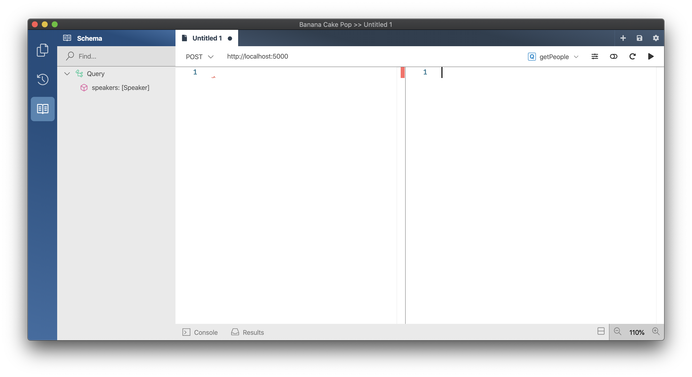
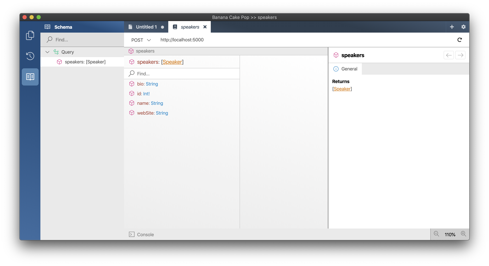
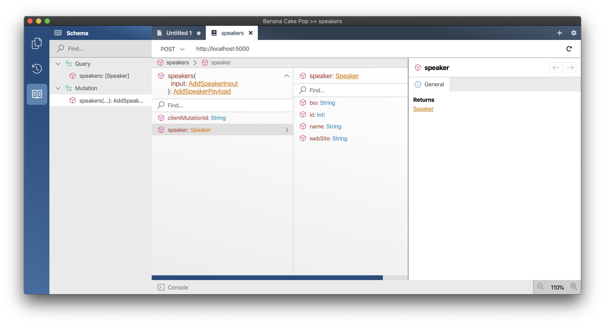
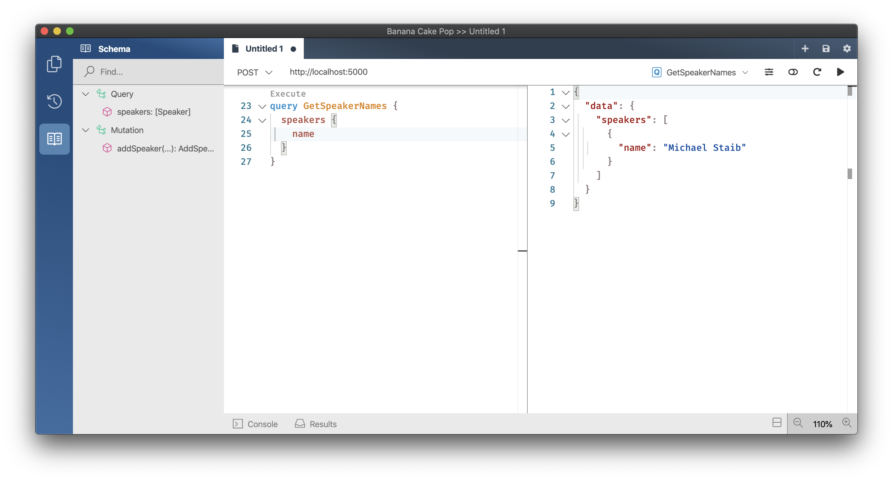

# Create a new GraphQL server project

1. Create a new project for our GraphQL Server.
   1. `dotnet new sln -n ConferencePlanner`
   1. `dotnet new web -n GraphQL`
   1. `dotnet sln add GraphQL`
1. Add a new folder `Data` where we want to place all our database related code.
   1. `mkdir GraphQL/Data`
1. Add a new file `Speaker.cs` in the `Data` directory using the following code:

   ```csharp
    using System.ComponentModel.DataAnnotations;

    namespace ConferencePlanner.GraphQL.Data
    {
        public class Speaker
        {
            public int Id { get; set; }

            [Required]
            [StringLength(200)]
            public string Name { get; set; }

            [StringLength(4000)]
            public string Bio { get; set; }

            [StringLength(1000)]
            public virtual string WebSite { get; set; }
        }
    }
   ```

1. Add a reference to the NuGet package package `Microsoft.EntityFrameworkCore.Sqlite` version `3.1.6`.
   1. `dotnet add GraphQL package Microsoft.EntityFrameworkCore.Sqlite --version 3.1.6`
1. Next we'll create a new Entity Framework DbContext. Create a new `ApplicationDbContext` class in the `Data` folder using the following code:

    ```csharp
    using Microsoft.EntityFrameworkCore;

    namespace ConferencePlanner.GraphQL.Data
    {
        public class ApplicationDbContext : DbContext
        {
            public ApplicationDbContext(DbContextOptions<ApplicationDbContext> options)
                : base(options)
            {

            }

            public DbSet<Speaker> Speakers { get; set; }
        }
    }
    ```

## Register the DB Context Service

1. Add the following code to the top of the `ConfigureServices()` method in `Startup.cs`:

    ```csharp
    services.AddDbContext<ApplicationDbContext>(options => options.UseSqlite("Data Source=conferences.db"));
    ```

    > This code registers the `ApplicationDbContext` service so it can be injected into resolvers.

## Configuring EF Migrations

1. Add a reference to the NuGet package `Microsoft.EntityFrameworkCore.Tools` version `3.1.6`.
   1. `dotnet add GraphQL package Microsoft.EntityFrameworkCore.Tools --version 3.1.6`

### Visual Studio: Package Manager Console

1. In Visual Studio, select the Tools -> NuGet Package Manager -> Package Manager Console

1. Run the following commands in the Package Manager Console

   ```console
   Add-Migration Initial
   Update-Database
   ```

### Command line

1. Install the EntityFramework global tool `dotnet-ef` using the following command:

   ```console
   dotnet new tool-manifest
   dotnet tool install dotnet-ef --version 3.1.6 --local
   ```

2. Open a command prompt and navigate to the project directory. (The directory containing the `Startup.cs` file).

3. Run the following commands in the command prompt:

    ```console
    dotnet build GraphQL
    dotnet ef migrations add Initial --project GraphQL
    dotnet ef database update --project GraphQL
    ```

Commands Explained

| Command                                                      | Description                                                                                                                                             |
| ------------------------------------------------------------ | ------------------------------------------------------------------------------------------------------------------------------------------------------- |
| `dotnet ef migrations add Initial` / `Add-Migration Initial` | generates code to create the initial database schema based on the model specified in 'ApplicationDbContext.cs'. `Initial` is the name of the migration. |
| `dotnet ef database update` / `Update-Database`              | creates the database                                                                                                                                    |

> If your database ever gets in a bad state and you'd like to reset things, you can use `dotnet ef database drop` followed by `dotnet ef database update` to remove your database and run all migrations again.

## Adding GraphQL

1. Add a reference to the NuGet package package `HotChocolate.AspNetCore` version `10.5.0`.
   1. `dotnet add GraphQL package HotChocolate.AspNetCore --version 10.5.0`
1. Next we'll create our query root type and add a resolver that fetches all of our speakers.

    ```csharp
    using System.Linq;
    using HotChocolate;
    using ConferencePlanner.GraphQL.Data;

    namespace ConferencePlanner.GraphQL
    {
        public class Query
        {
            public IQueryable<Speaker> GetSpeakers([Service] ApplicationDbContext context) =>
                context.Speakers;
        }
    }
    ```

1. Before we can do anything with our query root type we need to setup GraphQL and register our query root type. Add the following code below `AddDbContext` in the `ConfigureServices()` method in `Startup.cs`:

    ```csharp
    services.AddGraphQL(
        SchemaBuilder.New()
            .AddQueryType<Query>());
    ```

    > The above code registers a GraphQL schema with our dependency injection and with that registers our `Query` type.

1. Next we need to configure our GraphQL middleware so that the server knows how to execute GraphQL requests. For this add the following code after `app.UseRouting();` to the `Configure(IApplicationBuilder app, IWebHostEnvironment env)`method in `Startup.cs`

    ```csharp
    app.UseGraphQL();
    ```

    > Your Startup.cs should now look like the following:

    ```csharp
    using System;
    using System.Collections.Generic;
    using System.Threading.Tasks;
    using Microsoft.AspNetCore.Builder;
    using Microsoft.AspNetCore.Hosting;
    using Microsoft.AspNetCore.Http;
    using Microsoft.EntityFrameworkCore;
    using Microsoft.Extensions.DependencyInjection;
    using Microsoft.Extensions.Hosting;
    using ConferencePlanner.GraphQL.Data;
    using HotChocolate.AspNetCore;
    using HotChocolate;

    namespace GraphQL
    {
        public class Startup
        {
            // This method gets called by the runtime. Use this method to add services to the container.
            // For more information on how to configure your application, visit https://go.microsoft.com/fwlink/?LinkID=398940
            public void ConfigureServices(IServiceCollection services)
            {
                services.AddDbContext<ApplicationDbContext>(options => options.UseSqlite("Data Source=conferences.db"));

                services.AddGraphQL(
                    SchemaBuilder.New()
                        .AddQueryType<Query>());
            }

            // This method gets called by the runtime. Use this method to configure the HTTP request pipeline.
            public void Configure(IApplicationBuilder app, IWebHostEnvironment env)
            {
                if (env.IsDevelopment())
                {
                    app.UseDeveloperExceptionPage();
                }

                app.UseRouting();

                app.UseGraphQL();

                app.UseEndpoints(endpoints =>
                {
                    endpoints.MapGet("/", async context =>
                    {
                        await context.Response.WriteAsync("Hello World!");
                    });
                });
            }
        }
    }
    ```

1. Start the server.
   1. `dotnet run --project GraphQL`

    

1. Start Banana Cakepop and connect to our server.

    

1. Click in the schema explorer and click on the `speakers` field in order to check the return type of the `speakers` field.

    

## Adding Mutations

So, far we have added the Query root type to our schema, which allows us to query speakers. However, at this point, there is no way to add or modify any data. In this section, we are going to add the root Mutation type to add new speakers to our database.

> For mutations we are using the [relay mutation pattern](https://relay.dev/docs/en/graphql-server-specification.html#mutations) which is commonly used in GraphQL.

A mutation consists of three components, the input, the payload and the mutation itself. In our case we want to create a mutation called `addSpeaker`, by convention, mutations are named as verbs, their inputs are the name with "Input" appended at the end, and they return an object that is the name with "Payload" appended.

So, for our `addSpeaker` mutation, we create two types: `AddSpeakerInput` and `AddSpeakerPayload`.

1. Add a class `AddSpeakerInput` to your project with the following code:

   ```csharp
    namespace ConferencePlanner.GraphQL
    {
        public class AddSpeakerInput
        {
            public AddSpeakerInput(string name, string bio, string webSite, string clientMutationId)
            {
                Name = name;
                Bio = bio;
                WebSite = webSite;
                ClientMutationId = clientMutationId;
            }

            public string Name { get; }

            public string Bio { get; }

            public string WebSite { get; }

            public string ClientMutationId { get; }
        }
    }
   ```

   > The input and output (payload) both contain a client mutation identifier used to reconcile requests and responses in some client frameworks.

1. Next we add our `AddSpeakerPayload` which represents the output of our GraphQL mutation by adding the following code:

   ```csharp
    using ConferencePlanner.GraphQL.Data;

    namespace ConferencePlanner.GraphQL
    {
        public class AddSpeakerPayload
        {
            public AddSpeakerPayload(Speaker speaker, string clientMutationId)
            {
                Speaker = speaker;
                ClientMutationId = clientMutationId;
            }

            public Speaker Speaker { get; }

            public string ClientMutationId { get; }
        }
    }
   ```

1. Now lets add the actual mutation type with our `addSpeaker` mutation in it.

   ```csharp
    using System.Threading.Tasks;
    using ConferencePlanner.GraphQL.Data;
    using HotChocolate;

    namespace ConferencePlanner.GraphQL
    {
        public class Mutation
        {
            public async Task<AddSpeakerPayload> AddSpeakerAsync(
                AddSpeakerInput input,
                [Service] ApplicationDbContext context)
            {
                var speaker = new Speaker
                {
                    Name = input.Name,
                    Bio = input.Bio,
                    WebSite = input.WebSite
                };

                context.Speakers.Add(speaker);
                await context.SaveChangesAsync();

                return new AddSpeakerPayload(speaker, input.ClientMutationId);
            }
        }
    }
   ```

1. Last but not least you need to add the new `Mutation` type to your schema:

   ```csharp
    services.AddGraphQL(
        SchemaBuilder.New()
            .AddQueryType<Query>()
            .AddMutationType<Mutation>());
   ```

1. Start the server again in order to validate if it is working properly.
   1. `dotnet run --project GraphQL`

1. Explore with Banana Cakepop the changes schema to the schema. There should now be a mutation type and the `addSpeaker` mutation.
    

1. Next add a speaker by writing a GraphQL mutation.

   ```graphql
    mutation AddSpeaker {
      addSpeaker(input: {
        name: "Speaker Name"
        bio: "Speaker Bio"
        webSite: "http://speaker.website" }) {
        speaker {
          id
        }
      }
    }
   ```

    

1. Query the names of all the speakers in the database.

   ```graphql
    query GetSpeakerNames {
      speakers {
        name
      }
    }
   ```

    

## Summary

In this first session, you have learned how you can create a simple GraphQL project on top of ASP.NET Core.
You have leveraged Entity Framework to create your models and save those to the database.
Together, ASP.NET Core, Entity Framework, and Hot Chocolate let you build a simple GraphQL server quickly.
