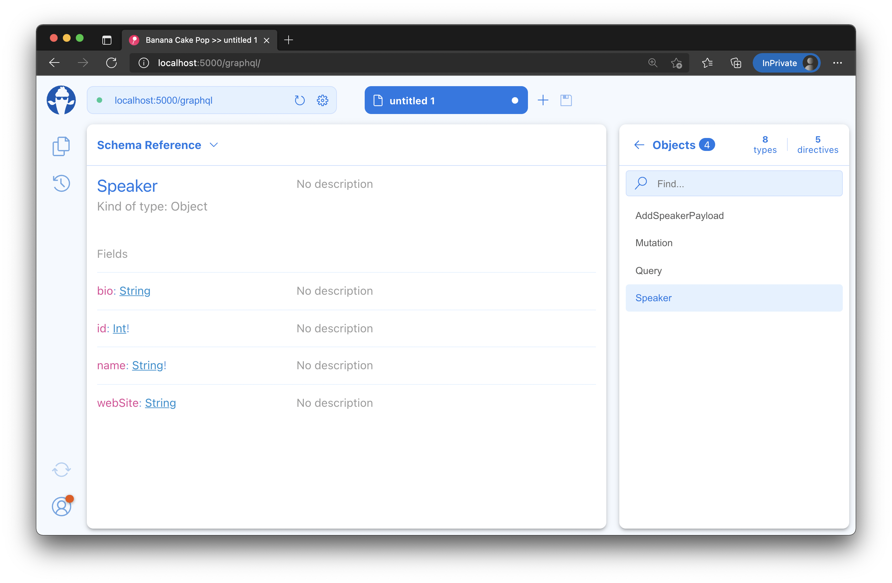

- [Nullability](#nullability)
  - [Summary](#summary)

# Nullability

The GraphQL type system distinguishes between nullable and non-nullable types. This helps the API consumer by providing guarantees when a field value can be trusted never to be null or when an input is not allowed to be null. The ability to rely on such information simplifies the frontend code since we do not have to write null checks for things that will never be null.

GraphQL and C# have one big difference regarding nullability. In C#, everything is non-null by default, meaning if I write the type name, e.g. `int` or `String`, it will be interpreted as nullable. To expose something as nullable, I have to append a `?` to the type name, e.g. `int?` or `String?`.

In GraphQL, this is the other way around; types are by default nullable, e.g., `Int` or `String` would be interpreted as nullable types. To have something non-null, we need to append a `!` to the type name. So, in GraphQL, `Int!` or `String!` would be non-null types.

1. Open the project file of your GraphQL server project `GraphQL.csproj` and inspect it:

   You project file should look like the following:

   ```xml
   <Project Sdk="Microsoft.NET.Sdk.Web">

    <PropertyGroup>
      <RootNamespace>ConferencePlanner.GraphQL.Data</RootNamespace>
      <TargetFramework>net6.0</TargetFramework>
      <Nullable>enable</Nullable>
      <ImplicitUsings>enable</ImplicitUsings>
    </PropertyGroup>

    <ItemGroup Condition="'$(ImplicitUsings)' == 'enable'">
      <Using Include="ConferencePlanner.GraphQL" />
    </ItemGroup>

    <ItemGroup>
      <PackageReference Include="HotChocolate.AspNetCore" Version="12.4.0" />
      <PackageReference Include="HotChocolate.Data.EntityFramework" Version="12.4.0" />
      <PackageReference Include="Microsoft.EntityFrameworkCore.Sqlite" Version="6.0.0" />
      <PackageReference Include="Microsoft.EntityFrameworkCore.Tools" Version="6.0.0">
        <IncludeAssets>runtime; build; native; contentfiles; analyzers; buildtransitive</IncludeAssets>
        <PrivateAssets>all</PrivateAssets>
      </PackageReference>
    </ItemGroup>

   </Project>
   ```

   With .NET 6, we have two crucial things here that are important.
   - Nullable: enable
     This enables nullable reference types.
   - ImplicitUsings: enable
     This automatically will add common namespace imports to all our code files.

2. Start our GraphQL server again, and let's have a look at our schema:

   1. `dotnet run --project GraphQL`
   2. Open Banana Cakepop
   3. Head over to the **Schema Reference**
   4. Search for the `Speaker` type and explore the nullability.

   

3. When we compare the C# Speaker type to its GraphQL counter part, we can see that Hot Chocolate will consider the nullability information and the data annotation attributes. In this case, the `Speaker.Name` is technically nullable in C#, but it is logically non-null. In this case, the Hot Chocolate will let the `RequiredAttribute` override the nullability information from the type.

   **GraphQL Type:**

   ```graphql
   type Speaker {
     id: Int!
     name: String!
     bio: String
     webSite: String
   }
   ```

   **C# Type:**

   ```csharp
   public class Speaker
   {
       public int Id { get; set; }

       [Required]
       [StringLength(200)]
       public string? Name { get; set; }

       [StringLength(4000)]
       public string? Bio { get; set; }

       [StringLength(1000)]
       public string? WebSite { get; set; }
   }
   ```

## Summary

In this session, we have further explored the GraphQL type system capabilities, by understanding how nullability works in GraphQL and how Hot Chocolate infers nullability from .NET types.

[**<< Session #1 - Building a basic GraphQL server API**](1-creating-a-graphql-server-project.md) | [**Session #3 - Understanding GraphQL query execution and DataLoader >>**](3-understanding-dataLoader.md) 