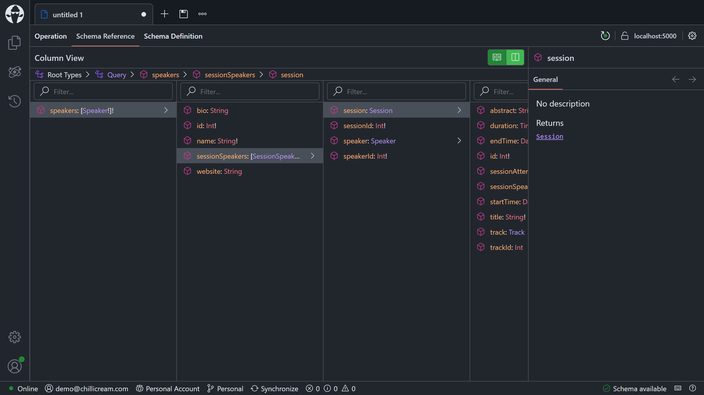
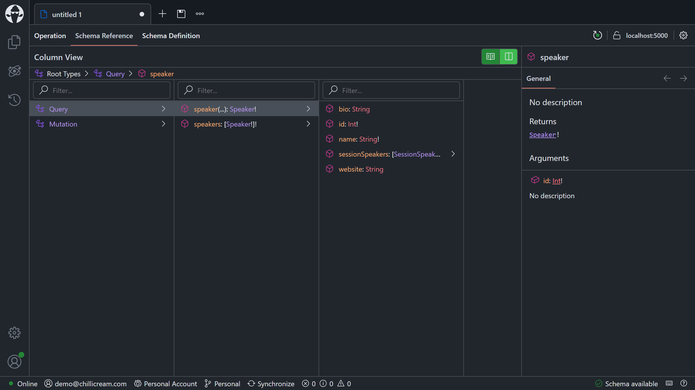
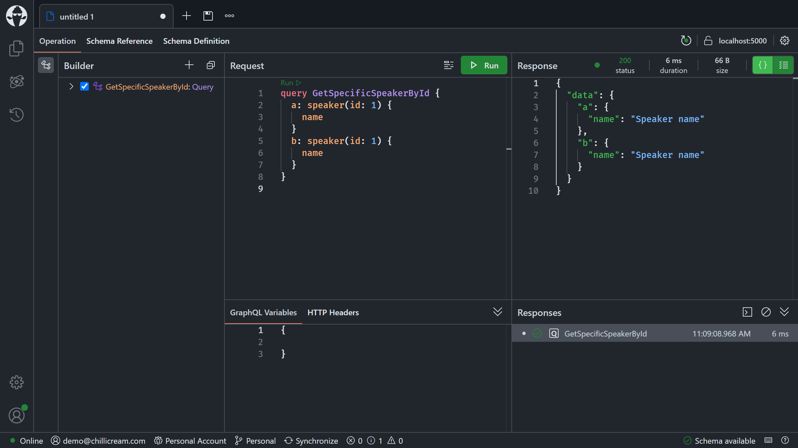

# Understanding DataLoader

- [Adding the remaining data models](#adding-the-remaining-data-models)
- [Adding a DataLoader](#adding-a-dataloader)
- [Type extensions](#type-extensions)
- [Summary](#summary)

## Adding the remaining data models

In order to expand our GraphQL server model further we've have several more data models to add, and unfortunately it's a little mechanical. You can copy the following classes manually, or open the [session 3 solution](/code/session-3).

1. Create an `Attendee.cs` class in the `Data` directory with the following code:

    ```csharp
    using System.ComponentModel.DataAnnotations;

    namespace ConferencePlanner.GraphQL.Data;

    public sealed class Attendee
    {
        public int Id { get; init; }

        [StringLength(200)]
        public required string FirstName { get; init; }

        [StringLength(200)]
        public required string LastName { get; init; }

        [StringLength(200)]
        public required string Username { get; init; }

        [StringLength(256)]
        public string? EmailAddress { get; init; }

        public ICollection<SessionAttendee> SessionsAttendees { get; init; } =
            new List<SessionAttendee>();
    }
    ```

1. Create a `Session.cs` class with the following code:

    ```csharp
    using System.ComponentModel.DataAnnotations;

    namespace ConferencePlanner.GraphQL.Data;

    public sealed class Session
    {
        public int Id { get; init; }

        [StringLength(200)]
        public required string Title { get; init; }

        [StringLength(4000)]
        public string? Abstract { get; init; }

        public DateTimeOffset? StartTime { get; set; }

        public DateTimeOffset? EndTime { get; set; }

        // Bonus points to those who can figure out why this is written this way.
        public TimeSpan Duration =>
            EndTime?.Subtract(StartTime ?? EndTime ?? DateTimeOffset.MinValue) ??
            TimeSpan.Zero;

        public int? TrackId { get; set; }

        public ICollection<SessionSpeaker> SessionSpeakers { get; init; } =
            new List<SessionSpeaker>();

        public ICollection<SessionAttendee> SessionAttendees { get; init; } =
            new List<SessionAttendee>();

        public Track? Track { get; init; }
    }
    ```

1. Create a `Track.cs` class with the following code:

    ```csharp
    using System.ComponentModel.DataAnnotations;

    namespace ConferencePlanner.GraphQL.Data;

    public sealed class Track
    {
        public int Id { get; init; }

        [StringLength(200)]
        public required string Name { get; set; }

        public ICollection<Session> Sessions { get; init; } =
            new List<Session>();
    }
    ```

1. Create a `SessionAttendee.cs` class with the following code:

    ```csharp
    namespace ConferencePlanner.GraphQL.Data;

    public sealed class SessionAttendee
    {
        public int SessionId { get; init; }

        public Session Session { get; init; } = null!;

        public int AttendeeId { get; init; }

        public Attendee Attendee { get; init; } = null!;
    }
    ```

1. Create a `SessionSpeaker.cs` class with the following code:

    ```csharp
    namespace ConferencePlanner.GraphQL.Data;

    public sealed class SessionSpeaker
    {
        public int SessionId { get; init; }

        public Session Session { get; init; } = null!;

        public int SpeakerId { get; init; }

        public Speaker Speaker { get; init; } = null!;
    }
    ```

1. Next, modify the `Speaker` class and add the following property to it:

    ```csharp
    public ICollection<SessionSpeaker> SessionSpeakers { get; init; } =
        new List<SessionSpeaker>();
    ```

    The class should now look like the following:

    ```csharp
    using System.ComponentModel.DataAnnotations;

    namespace ConferencePlanner.GraphQL.Data;

    public sealed class Speaker
    {
        public int Id { get; init; }

        [StringLength(200)]
        public required string Name { get; init; }

        [StringLength(4000)]
        public string? Bio { get; init; }

        [StringLength(1000)]
        public string? Website { get; init; }

        public ICollection<SessionSpeaker> SessionSpeakers { get; init; } =
            new List<SessionSpeaker>();
    }
    ```

1. Last but not least, update the `ApplicationDbContext` with the following code:

    ```csharp
    using Microsoft.EntityFrameworkCore;

    namespace ConferencePlanner.GraphQL.Data;

    public sealed class ApplicationDbContext(DbContextOptions<ApplicationDbContext> options)
        : DbContext(options)
    {
        public DbSet<Attendee> Attendees { get; init; }

        public DbSet<Session> Sessions { get; init; }

        public DbSet<Speaker> Speakers { get; init; }

        public DbSet<Track> Tracks { get; init; }

        protected override void OnModelCreating(ModelBuilder modelBuilder)
        {
            modelBuilder
                .Entity<Attendee>()
                .HasIndex(a => a.Username)
                .IsUnique();

            // Many-to-many: Session <-> Attendee
            modelBuilder
                .Entity<SessionAttendee>()
                .HasKey(sa => new { sa.SessionId, sa.AttendeeId });

            // Many-to-many: Speaker <-> Session
            modelBuilder
                .Entity<SessionSpeaker>()
                .HasKey(ss => new { ss.SessionId, ss.SpeakerId });
        }
    }
    ```

Now that we have all of our models in we need to create another migration and update our database.

1. First, validate your project by building it:

    ```shell
    dotnet build GraphQL
    ```

1. Next, generate a new migration for the database:

    ```shell
    dotnet ef migrations add Refactoring --project GraphQL
    ```

1. Lastly, update the database with the new migration:

    ```shell
    dotnet ef database update --project GraphQL
    ```

After having everything in let's have a look at our schema and see if something changed.

1. Start your server:

    ```shell
    dotnet run --project GraphQL
    ```

1. Open Banana Cake Pop.

1. Head over to the `Schema Reference` tab and have a look at the speaker.
    - **Note**: You might have to reload the schema. You can do so by clicking the `Reload Schema` button in the upper right corner.

    

## Adding a DataLoader

The idea of a [DataLoader](https://github.com/graphql/dataloader) is to batch multiple requests into one call to the database.

While we could write DataLoaders as individual classes, there is also a source generator to remove some of the boilerplate code.

1. Add a new class named `DataLoaders` with the following code:

    ```csharp
    using ConferencePlanner.GraphQL.Data;
    using Microsoft.EntityFrameworkCore;

    namespace ConferencePlanner.GraphQL;

    public static class DataLoaders
    {
        [DataLoader]
        public static async Task<IReadOnlyDictionary<int, Speaker>> SpeakerByIdAsync(
            IReadOnlyList<int> ids,
            ApplicationDbContext dbContext,
            CancellationToken cancellationToken)
        {
            return await dbContext.Speakers
                .Where(s => ids.Contains(s.Id))
                .ToDictionaryAsync(s => s.Id, cancellationToken);
        }
    }
    ```

    The source generator will generate DataLoader classes for methods with the `[DataLoader]` attribute.

1. Add a new method named `GetSpeakerAsync` to your `Queries.cs` file:

    ```csharp
    [Query]
    public static async Task<Speaker?> GetSpeakerAsync(
        int id,
        SpeakerByIdDataLoader speakerById,
        CancellationToken cancellationToken)
    {
        return await speakerById.LoadAsync(id, cancellationToken);
    }
    ```

    The `Queries.cs` file should now look like the following:

    ```csharp
    using ConferencePlanner.GraphQL.Data;
    using Microsoft.EntityFrameworkCore;

    namespace ConferencePlanner.GraphQL;

    public static class Queries
    {
        [Query]
        public static async Task<IEnumerable<Speaker>> GetSpeakersAsync(
            ApplicationDbContext dbContext,
            CancellationToken cancellationToken)
        {
            return await dbContext.Speakers.ToListAsync(cancellationToken);
        }

        [Query]
        public static async Task<Speaker?> GetSpeakerAsync(
            int id,
            SpeakerByIdDataLoader speakerById,
            CancellationToken cancellationToken)
        {
            return await speakerById.LoadAsync(id, cancellationToken);
        }
    }
    ```

1. Let's have a look at the new schema with Banana Cake Pop. For this, start your server and refresh Banana Cake Pop:

    ```shell
    dotnet run --project GraphQL
    ```

    

1. Now, test if the new field works correctly:

    ```graphql
    query GetSpecificSpeakerById {
      a: speaker(id: 1) {
        name
      }
      b: speaker(id: 1) {
        name
      }
    }
    ```

    

    If you look at the console output, you'll see that only a single SQL query is executed, instead of one for each speaker:

    ```console
    info: Microsoft.EntityFrameworkCore.Database.Command[20101]
      Executed DbCommand (1ms) [Parameters=[@__keys_0='?' (DbType = Object)], CommandType='Text', CommandTimeout='30']
      SELECT s."Id", s."Bio", s."Name", s."Website"
      FROM "Speakers" AS s
      WHERE s."Id" = ANY (@__keys_0)
    ```

## Type extensions

At the moment, we are purely inferring the schema from our C# classes. In some cases where we have everything under control, this might be a good thing, and everything is okay.

But if we, for instance, have some parts of the API not under our control and want to change the GraphQL schema representation of these APIs, type extensions can help. With Hot Chocolate, we can mix in these type extensions where we need them.

In our specific case, we want to make the GraphQL API nicer and remove the relationship objects like `SessionSpeaker`.

1. First let's add a new DataLoader in order to efficiently fetch sessions by speaker ID. Add the following method to the `DataLoaders` class:

    ```csharp
    [DataLoader]
    public static async Task<IReadOnlyDictionary<int, Session[]>> SessionsBySpeakerIdAsync(
        IReadOnlyList<int> speakerIds,
        ApplicationDbContext dbContext,
        CancellationToken cancellationToken)
    {
        return await dbContext.Speakers
            .Where(s => speakerIds.Contains(s.Id))
            .Select(s => new { s.Id, Sessions = s.SessionSpeakers.Select(ss => ss.Session) })
            .ToDictionaryAsync(
                s => s.Id,
                s => s.Sessions.ToArray(),
                cancellationToken);
    }
    ```

1. Create a new directory named `Types`:

    ```shell
    mkdir GraphQL/Types
    ```

1. Create a new class named `SpeakerType` in the `Types` directory with the following code:

    ```csharp
    using ConferencePlanner.GraphQL.Data;

    namespace ConferencePlanner.GraphQL.Types;

    [ObjectType<Speaker>]
    public static partial class SpeakerType
    {
        [BindMember(nameof(Speaker.SessionSpeakers))]
        public static async Task<IEnumerable<Session>> GetSessionsAsync(
            [Parent] Speaker speaker,
            SessionsBySpeakerIdDataLoader sessionsBySpeakerId,
            CancellationToken cancellationToken)
        {
            return await sessionsBySpeakerId.LoadRequiredAsync(speaker.Id, cancellationToken);
        }
    }
    ```

    In this type extension, we replace the existing `sessionSpeakers` field (property `SessionSpeakers`), with a new field named `sessions` (method `GetSessionsAsync`), using the `[BindMember]` attribute. The new field exposes the sessions associated with the speaker.

1. The new GraphQL representation of our speaker type is now:

    ```GraphQL
    type Speaker {
      sessions: [Session!]!
      id: Int!
      name: String!
      bio: String
      website: String
    }
    ```

1. Start your GraphQL server again:

    ```shell
    dotnet run --project GraphQL
    ```

1. Go back to Banana Cake Pop, refresh the schema, and execute the following query:

    ```graphql
    query GetSpeakerWithSessions {
      speaker(id: 1) {
        name
        sessions {
          title
        }
      }
    }
    ```

    > Since we do not have any data for sessions yet the server will return an empty list of sessions. Still, our server works already and we will soon be able to add more data.

## Summary

In this session, we've added DataLoaders to our GraphQL API and learned what DataLoaders are. We've also looked at a new way to extend our GraphQL types with type extensions, which lets us change the shape of types that we don't want to annotate with GraphQL attributes.

[**<< Session #1 - Creating a new GraphQL server project**](1-creating-a-graphql-server-project.md) | [**Session #3 - GraphQL schema design approaches >>**](3-schema-design.md)
