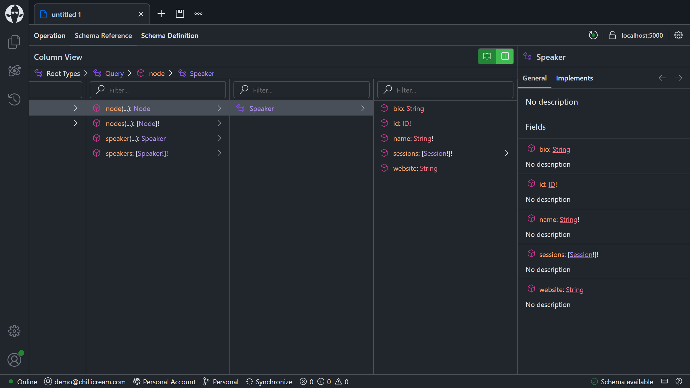

# GraphQL schema design approaches

- [Reorganizing types](#reorganizing-types)
  - [Reorganizing query types](#reorganizing-query-types)
  - [Reorganizing mutation types](#reorganizing-mutation-types)
  - [Reorganizing object types](#reorganizing-object-types)
  - [Reorganizing DataLoaders](#reorganizing-dataloaders)
- [Enabling Mutation Conventions](#enabling-mutation-conventions)
- [Enabling Global Object Identification](#enabling-global-object-identification)
- [Building out the schema](#building-out-the-schema)
  - [Thinking beyond CRUD](#thinking-beyond-crud)
  - [Offering plural versions of fields and being precise about field names](#offering-plural-versions-of-fields-and-being-precise-about-field-names)
- [Summary](#summary)

In GraphQL, most APIs are designed in [Relay](https://relay.dev/) style. Relay is Facebook's GraphQL client for React and represents Facebook's opinionated view on GraphQL. The GraphQL community adopted the [Relay server specification](https://relay.dev/docs/guides/graphql-server-specification/) since it provides a battle-tested way of exposing GraphQL at massive scale.

The two core assumptions that Relay makes about a GraphQL server are that it provides:

1. A mechanism for refetching an object.
1. A description of how to page through connections.

## Reorganizing types

First, we will restructure our GraphQL server so that it will better scale once we add more types. With Hot Chocolate, we can split types into multiple classes, which is especially useful with root types. Splitting our root types allows us to organize our queries, mutations, and subscriptions by topic rather than having all of them in one massive class. Moreover, in tests, we can load only the parts of a query, mutation, or subscription type that we need.

### Reorganizing query types

1. Create a new directory named `Speakers`:

    ```shell
    mkdir GraphQL/Speakers
    ```

1. Move the `Queries.cs` file to the `Speakers` directory and rename it to `SpeakerQueries.cs`:

    ```shell
    mv GraphQL/Queries.cs GraphQL/Speakers/SpeakerQueries.cs
    ```

1. Now, update the namespace and class name, annotate the renamed class with the `[QueryType]` attribute, and remove the `[Query]` attribute from the methods. The class should look like this now:

    ```csharp
    using ConferencePlanner.GraphQL.Data;
    using Microsoft.EntityFrameworkCore;

    namespace ConferencePlanner.GraphQL.Speakers;

    [QueryType]
    public static class SpeakerQueries
    {
        public static async Task<IEnumerable<Speaker>> GetSpeakersAsync(
            ApplicationDbContext dbContext,
            CancellationToken cancellationToken)
        {
            return await dbContext.Speakers.ToListAsync(cancellationToken);
        }

        public static async Task<Speaker?> GetSpeakerAsync(
            int id,
            SpeakerByIdDataLoader speakerById,
            CancellationToken cancellationToken)
        {
            return await speakerById.LoadAsync(id, cancellationToken);
        }
    }
    ```

### Reorganizing mutation types

1. Move the `Mutations.cs` file to the `Speakers` directory and rename it to `SpeakerMutations.cs`:

    ```shell
    mv GraphQL/Mutations.cs GraphQL/Speakers/SpeakerMutations.cs
    ```

1. Now, update the namespace and class name, annotate the renamed class with the `[MutationType]` attribute, and remove the `[Mutation]` attribute from the method. The class should look like this now:

    ```csharp
    using ConferencePlanner.GraphQL.Data;

    namespace ConferencePlanner.GraphQL.Speakers;

    [MutationType]
    public static class SpeakerMutations
    {
        public static async Task<Speaker> AddSpeakerAsync(
            AddSpeakerInput input,
            ApplicationDbContext dbContext,
            CancellationToken cancellationToken)
        {
            var speaker = new Speaker
            {
                Name = input.Name,
                Bio = input.Bio,
                Website = input.Website
            };

            dbContext.Speakers.Add(speaker);

            await dbContext.SaveChangesAsync(cancellationToken);

            return speaker;
        }
    }
    ```

1. Move the `AddSpeakerInput.cs` file into the `Speakers` directory, and update the namespace:

    ```shell
    mv GraphQL/AddSpeakerInput.cs GraphQL/Speakers/AddSpeakerInput.cs
    ```

    ```diff
    - namespace ConferencePlanner.GraphQL;
    + namespace ConferencePlanner.GraphQL.Speakers;
    ```

### Reorganizing object types

1. Move the `SpeakerType.cs` file from the `Types` directory to the `Speakers` directory, and update the namespace:

    ```shell
    mv GraphQL/Types/SpeakerType.cs GraphQL/Speakers/SpeakerType.cs
    ```

    ```diff
    - namespace ConferencePlanner.GraphQL.Types;
    + namespace ConferencePlanner.GraphQL.Speakers;
    ```

1. Delete the empty `Types` directory:

    ```shell
    rm --dir GraphQL/Types
    ```

### Reorganizing DataLoaders

1. Add a new static class named `SpeakerDataLoaders` to the `Speakers` directory, and move the `SpeakerByIdAsync` DataLoader method from `DataLoaders.cs`:

    ```csharp
    using ConferencePlanner.GraphQL.Data;
    using Microsoft.EntityFrameworkCore;

    namespace ConferencePlanner.GraphQL.Speakers;

    public static class SpeakerDataLoaders
    {
        [DataLoader]
        public static async Task<IReadOnlyDictionary<int, Speaker>> SpeakerByIdAsync(
            IReadOnlyList<int> ids,
            ApplicationDbContext dbContext,
            CancellationToken cancellationToken)
        {
            return await dbContext.Speakers
                .Where(s => ids.Contains(s.Id))
                .ToDictionaryAsync(s => s.Id, cancellationToken);
        }
    }
    ```

1. Create a new directory named `Sessions`:

    ```shell
    mkdir GraphQL/Sessions
    ```

1. Add a new static class named `SessionDataLoaders` to the `Sessions` directory, and move the `SessionByIdAsync` DataLoader method from `DataLoaders.cs`:

    ```csharp
    using ConferencePlanner.GraphQL.Data;
    using Microsoft.EntityFrameworkCore;

    namespace ConferencePlanner.GraphQL.Sessions;

    public static class SessionDataLoaders
    {
        [DataLoader]
        public static async Task<IReadOnlyDictionary<int, Session>> SessionByIdAsync(
            IReadOnlyList<int> ids,
            ApplicationDbContext dbContext,
            CancellationToken cancellationToken)
        {
            return await dbContext.Sessions
                .Where(s => ids.Contains(s.Id))
                .ToDictionaryAsync(s => s.Id, cancellationToken);
        }
    }
    ```

    We also need to add an additional `using` directive to `SpeakerType.cs`:

    ```diff
      using ConferencePlanner.GraphQL.Data;
    + using ConferencePlanner.GraphQL.Sessions;
    ```

1. Delete the empty `DataLoaders.cs` file:

    ```shell
    rm GraphQL/DataLoaders.cs
    ```

## Enabling Mutation Conventions

Hot Chocolate has built-in conventions for mutations to minimize boilerplate code. Instead of manually creating payload types, Hot Chocolate can generate these types for us automatically.

1. Enable mutation conventions by adding the following line in `Program.cs`:

    ```diff
      .AddGraphQLServer()
    + .AddMutationConventions()
    ```

1. Update the `AddSpeakerAsync` method in `SpeakerMutations.cs` to return the `Speaker` directly, instead of the `AddSpeakerPayload`:

    ```diff
    - public static async Task<AddSpeakerPayload> AddSpeakerAsync(
    + public static async Task<Speaker> AddSpeakerAsync(
    ```

    ```diff
    - return new AddSpeakerPayload(speaker);
    + return speaker;
    ```

1. Delete the `AddSpeakerPayload.cs` file, as this file is no longer needed:

    ```shell
    rm GraphQL/AddSpeakerPayload.cs
    ```

## Enabling Global Object Identification

The first thing that we have to do here is to enable [Global Object Identification](https://chillicream.com/docs/hotchocolate/v14/defining-a-schema/relay/#global-object-identification) on the schema. After that, we'll focus on the first Relay server specification called [Object Identification](https://relay.dev/docs/guides/graphql-server-specification/#object-identification).

1. Enable Global Object Identification for the schema in `Program.cs`:

    ```diff
      .AddGraphQLServer()
    + .AddGlobalObjectIdentification()
      .AddMutationConventions()
    ```

1. Update the `GetSpeakerAsync` method in `SpeakerQueries.cs` by adding the `[NodeResolver]` attribute:

    ```diff
    + [NodeResolver]
      public static async Task<Speaker> GetSpeakerAsync(
    ```

    The `NodeResolver` attribute marks the node resolver for a Relay node type (in this case, the `Speaker` type). It will also set the GraphQL type of the `id` parameter to `ID`.

1. Start the GraphQL server:

    ```shell
    dotnet run --project GraphQL
    ```

1. Head to Banana Cake Pop and refresh the schema.

    

## Building out the schema

This step will add more DataLoaders and schema types. While this will be a bit mechanical, it will form the basis for our ventures into proper GraphQL schema design.

We'll start by adding the rest of the DataLoaders that we'll need. Then we'll add type extensions for `Attendee`, `Session`, and `Track`. Once we have all of this in, we'll start diving into some schema design rules and how to apply them.

1. Create a new directory named `Attendees`:

    ```shell
    mkdir GraphQL/Attendees
    ```

1. Add a new static class named `AttendeeDataLoaders` to the `Attendees` directory, with an `AttendeeByIdAsync` DataLoader:

    ```csharp
    using ConferencePlanner.GraphQL.Data;
    using Microsoft.EntityFrameworkCore;

    namespace ConferencePlanner.GraphQL.Attendees;

    public static class AttendeeDataLoaders
    {
        [DataLoader]
        public static async Task<IReadOnlyDictionary<int, Attendee>> AttendeeByIdAsync(
            IReadOnlyList<int> ids,
            ApplicationDbContext dbContext,
            CancellationToken cancellationToken)
        {
            return await dbContext.Attendees
                .Where(a => ids.Contains(a.Id))
                .ToDictionaryAsync(a => a.Id, cancellationToken);
        }
    }
    ```

1. Add a new static class named `TrackDataLoaders` to the `Tracks` directory, with a `TrackByIdAsync` DataLoader:

    ```csharp
    using ConferencePlanner.GraphQL.Data;
    using Microsoft.EntityFrameworkCore;

    namespace ConferencePlanner.GraphQL.Tracks;

    public static class TrackDataLoaders
    {
        [DataLoader]
        public static async Task<IReadOnlyDictionary<int, Track>> TrackByIdAsync(
            IReadOnlyList<int> ids,
            ApplicationDbContext dbContext,
            CancellationToken cancellationToken)
        {
            return await dbContext.Tracks
                .Where(t => ids.Contains(t.Id))
                .ToDictionaryAsync(t => t.Id, cancellationToken);
        }
    }
    ```

1. Now, add the missing type classes, `AttendeeType`, `TrackType`, and `SessionType`:

    `GraphQL/Attendees/AttendeeType.cs`

    ```csharp
    using ConferencePlanner.GraphQL.Data;
    using ConferencePlanner.GraphQL.Sessions;
    using Microsoft.EntityFrameworkCore;

    namespace ConferencePlanner.GraphQL.Attendees;

    [ObjectType<Attendee>]
    public static partial class AttendeeType
    {
        static partial void Configure(IObjectTypeDescriptor<Attendee> descriptor)
        {
            descriptor
                .ImplementsNode()
                .IdField(a => a.Id)
                .ResolveNode(
                    async (ctx, id)
                        => await ctx.DataLoader<AttendeeByIdDataLoader>()
                            .LoadAsync(id, ctx.RequestAborted));

            descriptor.Ignore(a => a.SessionsAttendees);
        }

        public static async Task<IEnumerable<Session>> GetSessionsAsync(
            [Parent] Attendee attendee,
            ApplicationDbContext dbContext,
            SessionByIdDataLoader sessionById,
            CancellationToken cancellationToken)
        {
            var sessionIds = await dbContext.Attendees
                .Where(a => a.Id == attendee.Id)
                .Include(a => a.SessionsAttendees)
                .SelectMany(a => a.SessionsAttendees.Select(sa => sa.SessionId))
                .ToArrayAsync(cancellationToken);

            return await sessionById.LoadRequiredAsync(sessionIds, cancellationToken);
        }
    }
    ```

    Note that since we're not exposing an `attendeeById` query where we could have applied the `[NodeResolver]` attribute, we instead define the node resolver using the descriptor:

    - `ImplementsNode` marks the type as implementing the `Node` interface.
    - `IdField` specifies the ID member of the node type.
    - `ResolveNode` specifies a delegate to resolve the node from its ID.

    `GraphQL/Sessions/SessionType.cs`

    ```csharp
    using ConferencePlanner.GraphQL.Attendees;
    using ConferencePlanner.GraphQL.Data;
    using ConferencePlanner.GraphQL.Speakers;
    using ConferencePlanner.GraphQL.Tracks;
    using Microsoft.EntityFrameworkCore;

    namespace ConferencePlanner.GraphQL.Sessions;

    [ObjectType<Session>]
    public static partial class SessionType
    {
        static partial void Configure(IObjectTypeDescriptor<Session> descriptor)
        {
            descriptor
                .Ignore(s => s.SessionSpeakers)
                .Ignore(s => s.SessionAttendees);

            descriptor
                .Field(s => s.TrackId)
                .ID();
        }

        public static async Task<IEnumerable<Speaker>> GetSpeakersAsync(
            [Parent] Session session,
            ApplicationDbContext dbContext,
            SpeakerByIdDataLoader speakerById,
            CancellationToken cancellationToken)
        {
            var speakerIds = await dbContext.Sessions
                .Where(s => s.Id == session.Id)
                .Include(s => s.SessionSpeakers)
                .SelectMany(s => s.SessionSpeakers.Select(ss => ss.SpeakerId))
                .ToArrayAsync(cancellationToken);

            return await speakerById.LoadRequiredAsync(speakerIds, cancellationToken);
        }

        public static async Task<IEnumerable<Attendee>> GetAttendeesAsync(
            [Parent] Session session,
            ApplicationDbContext dbContext,
            AttendeeByIdDataLoader attendeeById,
            CancellationToken cancellationToken)
        {
            var attendeeIds = await dbContext.Sessions
                .Where(s => s.Id == session.Id)
                .Include(s => s.SessionAttendees)
                .SelectMany(s => s.SessionAttendees.Select(sa => sa.AttendeeId))
                .ToArrayAsync(cancellationToken);

            return await attendeeById.LoadRequiredAsync(attendeeIds, cancellationToken);
        }

        public static async Task<Track?> GetTrackAsync(
            [Parent] Session session,
            TrackByIdDataLoader trackById,
            CancellationToken cancellationToken)
        {
            if (session.TrackId is null)
            {
                return null;
            }

            return await trackById.LoadAsync(session.TrackId.Value, cancellationToken);
        }
    }
    ```

    `GraphQL/Tracks/TrackType.cs`

    ```csharp
    using ConferencePlanner.GraphQL.Data;
    using ConferencePlanner.GraphQL.Sessions;
    using Microsoft.EntityFrameworkCore;

    namespace ConferencePlanner.GraphQL.Tracks;

    [ObjectType<Track>]
    public static partial class TrackType
    {
        public static async Task<IEnumerable<Session>> GetSessionsAsync(
            [Parent] Track track,
            ApplicationDbContext dbContext,
            SessionByIdDataLoader sessionById,
            CancellationToken cancellationToken)
        {
            var sessionIds = await dbContext.Sessions
                .Where(s => s.TrackId == track.Id)
                .Select(s => s.Id)
                .ToArrayAsync(cancellationToken);

            return await sessionById.LoadRequiredAsync(sessionIds, cancellationToken);
        }
    }
    ```

Great, we now have our base schema and are ready to dive into some schema design topics. Although GraphQL has a single root query type, a single root mutation type, and a single root subscription type, Hot Chocolate allows splitting the root types into multiple classes, which will enable us to organize our schema around topics rather than divide it along its root types.

### Thinking beyond CRUD

GraphQL represents a much better way to expose APIs over HTTP. GraphQL wants us to think beyond standard [CRUD](https://en.wikipedia.org/wiki/Create,_read,_update_and_delete) APIs. By using action- or behavior-specific fields and mutations, we can create a more human-readable API that helps clients to use it.

In this chapter, we'll design our mutation API by really thinking about the use cases of our conference API. We don't just want to expose our database model to the user; we want to create an understandable and easy-to-use API driven by use cases rather than the raw data structures.

First, we'll focus on the sessions. The session is the primary data model we are interacting with. People want to look up sessions, schedule sessions, search for sessions, or even file new sessions.

Conferences typically first ask for papers; after some time, they will accept some of the proposed talks. After more time, they will build from these sessions the schedule. Often the program is divided into tracks. A talk will also often be moved around until the conference starts, but even at this point, schedule changes might happen.

This reflection on our subject at hand leads us to two mutations that we need. First, we need to be able to add new sessions; then, we need to be able to schedule sessions on a specific track and time slot.

1. Add a new file named `SessionExceptions.cs` in the `Sessions` directory, with the following code:

    ```csharp
    namespace ConferencePlanner.GraphQL.Sessions;

    public sealed class EndTimeInvalidException() : Exception("EndTime must be after StartTime.");

    public sealed class NoSpeakerException() : Exception("No speaker assigned.");

    public sealed class SessionNotFoundException() : Exception("Session not found.");

    public sealed class TitleEmptyException() : Exception("The title cannot be empty.");
    ```

1. Add a new record named `AddSessionInput` in the `Sessions` directory, with the following code:

    ```csharp
    using ConferencePlanner.GraphQL.Data;

    namespace ConferencePlanner.GraphQL.Sessions;

    public sealed record AddSessionInput(
        string Title,
        string? Abstract,
        [property: ID<Speaker>] IReadOnlyList<int> SpeakerIds);
    ```

1. Next, add a new static class named `SessionMutations` in the `Sessions` directory, with the following code:

    ```csharp
    using ConferencePlanner.GraphQL.Data;

    namespace ConferencePlanner.GraphQL.Sessions;

    [MutationType]
    public static class SessionMutations
    {
        [Error<TitleEmptyException>]
        [Error<NoSpeakerException>]
        public static async Task<Session> AddSessionAsync(
            AddSessionInput input,
            ApplicationDbContext dbContext,
            CancellationToken cancellationToken)
        {
            if (string.IsNullOrEmpty(input.Title))
            {
                throw new TitleEmptyException();
            }

            if (input.SpeakerIds.Count == 0)
            {
                throw new NoSpeakerException();
            }

            var session = new Session
            {
                Title = input.Title,
                Abstract = input.Abstract
            };

            foreach (var speakerId in input.SpeakerIds)
            {
                session.SessionSpeakers.Add(new SessionSpeaker
                {
                    SpeakerId = speakerId
                });
            }

            dbContext.Sessions.Add(session);

            await dbContext.SaveChangesAsync(cancellationToken);

            return session;
        }
    }
    ```

    The `Error<TError>` attribute registers a middleware that will catch all exceptions of type `TError` on mutations and queries. By annotating the attribute the response type of the annotated resolver will be automatically extended.

    > Our `addSession` mutation will only let you specify the title, the abstract, and the speakers.

1. Next, add a `ScheduleSessionInput` record to our `Sessions` directory with the following code:

    ```csharp
    using ConferencePlanner.GraphQL.Data;

    namespace ConferencePlanner.GraphQL.Sessions;

    public sealed record ScheduleSessionInput(
        [property: ID<Session>] int SessionId,
        [property: ID<Track>] int TrackId,
        DateTimeOffset StartTime,
        DateTimeOffset EndTime);
    ```

1. Now, add the following `scheduleSession` mutation to the `SessionMutations` class:

    ```csharp
    [Error<EndTimeInvalidException>]
    [Error<SessionNotFoundException>]
    public static async Task<Session> ScheduleSessionAsync(
        ScheduleSessionInput input,
        ApplicationDbContext dbContext,
        CancellationToken cancellationToken)
    {
        if (input.EndTime < input.StartTime)
        {
            throw new EndTimeInvalidException();
        }

        var session = await dbContext.Sessions.FindAsync([input.SessionId], cancellationToken);

        if (session is null)
        {
            throw new SessionNotFoundException();
        }

        session.TrackId = input.TrackId;
        session.StartTime = input.StartTime;
        session.EndTime = input.EndTime;

        await dbContext.SaveChangesAsync(cancellationToken);

        return session;
    }
    ```

    While we are now able to add sessions and then schedule them, we still need some mutations to create and rename tracks.

1. Create a new directory named `Tracks`:

    ```shell
    mkdir GraphQL/Tracks
    ```

1. Add a new file named `TrackExceptions.cs` in the `Tracks` directory, with the following code:

    ```csharp
    namespace ConferencePlanner.GraphQL.Tracks;

    public sealed class TrackNotFoundException() : Exception("Track not found.");
    ```

1. Add a record named `AddTrackInput` to the `Tracks` directory with the following code:

    ```csharp
    namespace ConferencePlanner.GraphQL.Tracks;

    public sealed record AddTrackInput(string Name);
    ```

1. Now that you have the input file in, create a new static class named `TrackMutations` with the following code:

    ```csharp
    using ConferencePlanner.GraphQL.Data;

    namespace ConferencePlanner.GraphQL.Tracks;

    [MutationType]
    public static class TrackMutations
    {
        public static async Task<Track> AddTrackAsync(
            AddTrackInput input,
            ApplicationDbContext dbContext,
            CancellationToken cancellationToken)
        {
            var track = new Track { Name = input.Name };

            dbContext.Tracks.Add(track);

            await dbContext.SaveChangesAsync(cancellationToken);

            return track;
        }
    }
    ```

1. Next, we need to get our `renameTrack` mutation in. For this create a new record named `RenameTrackInput` and place it in the `Tracks` directory:

    ```csharp
    using ConferencePlanner.GraphQL.Data;

    namespace ConferencePlanner.GraphQL.Tracks;

    public sealed record RenameTrackInput([property: ID<Track>] int Id, string Name);
    ```

1. Lastly, we'll add the `renameTrack` mutation to our `TrackMutations` class:

    ```csharp
    [Error<TrackNotFoundException>]
    public static async Task<Track> RenameTrackAsync(
        RenameTrackInput input,
        ApplicationDbContext dbContext,
        CancellationToken cancellationToken)
    {
        var track = await dbContext.Tracks.FindAsync([input.Id], cancellationToken);

        if (track is null)
        {
            throw new TrackNotFoundException();
        }

        track.Name = input.Name;

        await dbContext.SaveChangesAsync(cancellationToken);

        return track;
    }
    ```

1. Start your GraphQL server and verify that your mutations work by adding some sessions, creating tracks, and scheduling the sessions to the tracks:

    ```shell
    dotnet run --project GraphQL
    ```

> The DateTime format in GraphQL is specified by [RFC 3339](https://datatracker.ietf.org/doc/html/rfc3339) and looks like the following: `1985-04-12T23:20:50.52Z`. More about the GraphQL `DateTime` scalar can be found here: <https://www.graphql-scalars.com/date-time/>

### Offering plural versions of fields and being precise about field names

With GraphQL, we want to think about efficiency a lot. For instance, we offer mutations with one `input` argument so that clients can assign this argument from one variable without needing to deconstruct. Almost every little aspect in GraphQL is done so that you can request data more efficiently. That is why we should also design our schema in such a way that we allow users of our API to fetch multiple entities in one go.

Sure, we can technically do that already:

```graphql
{
  speaker1: speaker(id: 1) {
    name
  }
  speaker2: speaker(id: 2) {
    name
  }
}
```

But with plural versions, we can specify a variable of IDs and pass that into a query without modifying the query text itself. By doing that, we can use static queries on our client and also let the query engine of the GraphQL server optimize this static query for execution. Further, we can write a resolver that is optimized to fetch data in one go. Offering plural fields allows for more flexibility and better performance.

The second aspect here is to be more specific with our field names. The name `speaker` is quite unspecific, and we'll already start to see a problem with this once we introduce a plural version of it named `speakers`, since we already have a field named `speakers` that is the list of speakers. A good choice in `GraphQL` would be to name the fields `speakerById` and the second one, `speakersById`.

In this section, we'll optimize our `Query` type by bringing in more fields to query our API. Also we'll restructure our query type to offer plural versions of our fields that fetch by ID.

1. Head over to your `SpeakerQueries` class and update the `GetSpeakerAsync` method to be named `GetSpeakerByIdAsync`:

    ```diff
      [NodeResolver]
    - public static async Task<Speaker> GetSpeakerAsync(
    + public static async Task<Speaker> GetSpeakerByIdAsync(
    ```

1. Next, introduce a new `GetSpeakersByIdAsync` method as our plural version:

    ```csharp
    public static async Task<IEnumerable<Speaker>> GetSpeakersByIdAsync(
        [ID<Speaker>] int[] ids,
        SpeakerByIdDataLoader speakerById,
        CancellationToken cancellationToken)
    {
        return await speakerById.LoadRequiredAsync(ids, cancellationToken);
    }
    ```

    > Note that the DataLoader can also fetch multiple entities for us.

1. Add a new static class named `SessionQueries` to the `Sessions` directory with the following code:

    ```csharp
    using ConferencePlanner.GraphQL.Data;
    using Microsoft.EntityFrameworkCore;

    namespace ConferencePlanner.GraphQL.Sessions;

    [QueryType]
    public static class SessionQueries
    {
        public static async Task<IEnumerable<Session>> GetSessionsAsync(
            ApplicationDbContext dbContext,
            CancellationToken cancellationToken)
        {
            return await dbContext.Sessions.ToListAsync(cancellationToken);
        }

        [NodeResolver]
        public static async Task<Session?> GetSessionByIdAsync(
            int id,
            SessionByIdDataLoader sessionById,
            CancellationToken cancellationToken)
        {
            return await sessionById.LoadAsync(id, cancellationToken);
        }

        public static async Task<IEnumerable<Session>> GetSessionsByIdAsync(
            [ID<Session>] int[] ids,
            SessionByIdDataLoader sessionById,
            CancellationToken cancellationToken)
        {
            return await sessionById.LoadRequiredAsync(ids, cancellationToken);
        }
    }
    ```

1. Next, add a new static class named `TrackQueries` to the `Tracks` directory with the following code:

    ```csharp
    using ConferencePlanner.GraphQL.Data;
    using Microsoft.EntityFrameworkCore;

    namespace ConferencePlanner.GraphQL.Tracks;

    [QueryType]
    public static class TrackQueries
    {
        public static async Task<IEnumerable<Track>> GetTracksAsync(
            ApplicationDbContext dbContext,
            CancellationToken cancellationToken)
        {
            return await dbContext.Tracks.ToListAsync(cancellationToken);
        }

        [NodeResolver]
        public static async Task<Track?> GetTrackByIdAsync(
            int id,
            TrackByIdDataLoader trackById,
            CancellationToken cancellationToken)
        {
            return await trackById.LoadAsync(id, cancellationToken);
        }

        public static async Task<IEnumerable<Track>> GetTracksByIdAsync(
            [ID<Track>] int[] ids,
            TrackByIdDataLoader trackById,
            CancellationToken cancellationToken)
        {
            return await trackById.LoadRequiredAsync(ids, cancellationToken);
        }
    }
    ```

1. Start your GraphQL server and verify with Banana Cake Pop that you can use the new queries:

    ```shell
    dotnet run --project GraphQL
    ```

## Summary

We've covered quite a lot in this section. We've learned that GraphQL is designed for efficiency and that many of the schema design concepts are designed around this core principle of GraphQL. We looked at how mutations should be structured, and that we should aim to design GraphQL schemas not around a database schema, but instead around our business model. With GraphQL we have such strong capabilities to express our business model that we should look beyond simple CRUD. Expressively design your schema so that each mutation conveys very clearly what it does. Allow your consumers to fetch single entities or multiple entities without forcing them to use aliases.

[**<< Session #2 - Understanding DataLoader**](2-understanding-data-loader.md) | [**Session #4 - Understanding middleware >>**](4-understanding-middleware.md)
