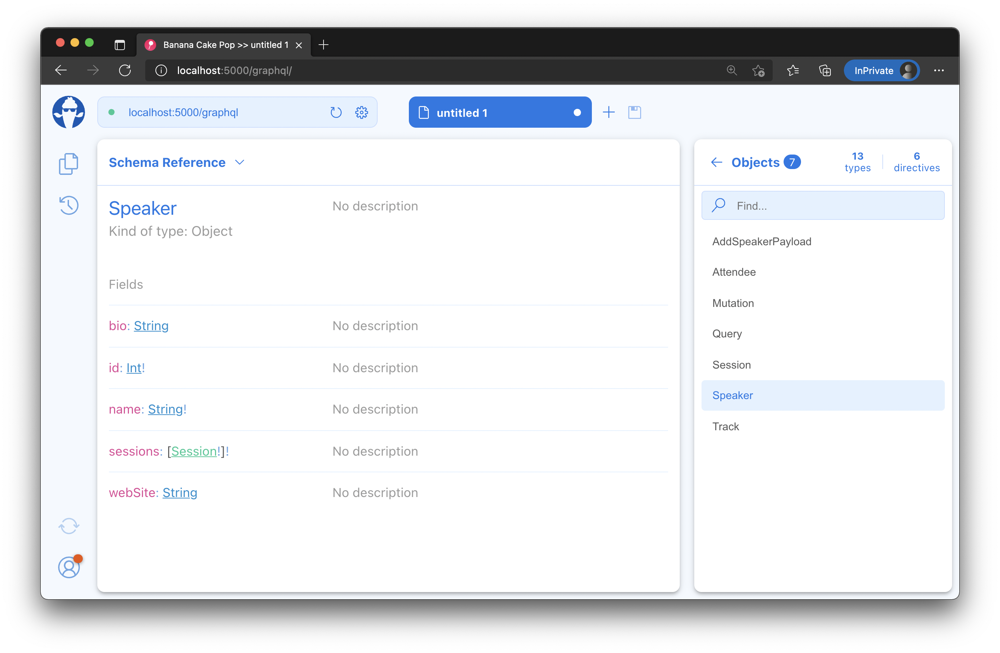
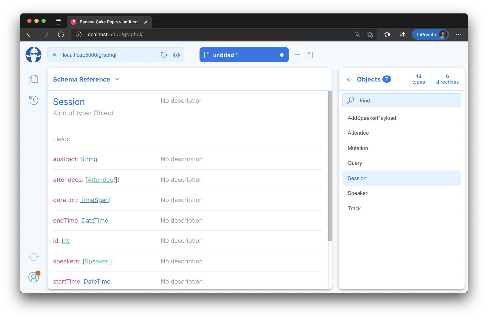
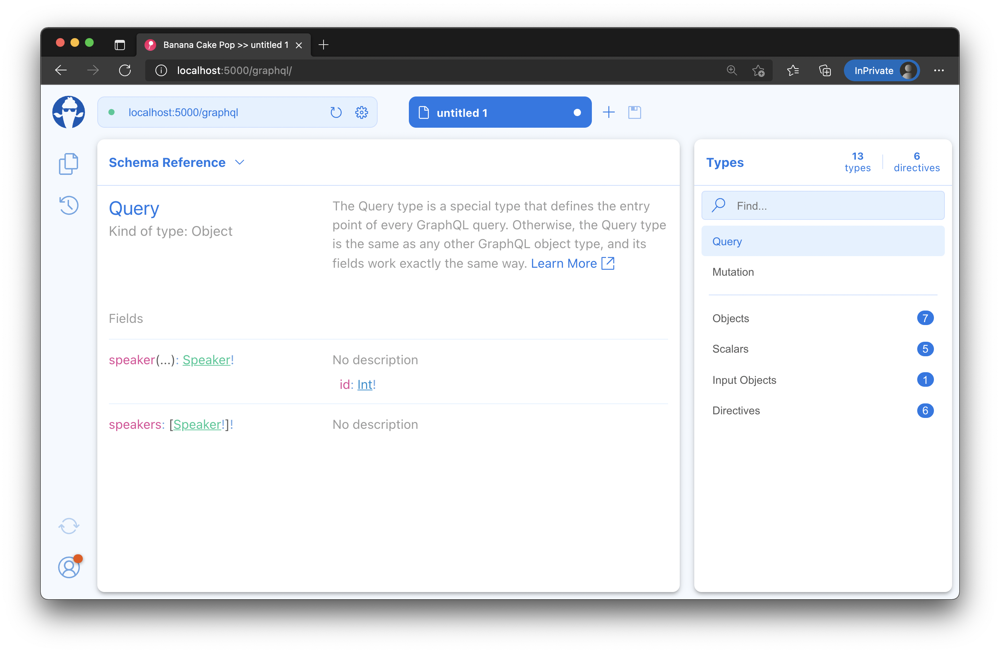
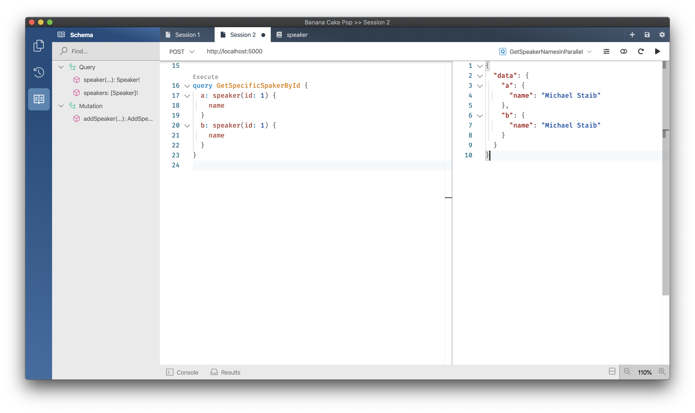

- [Understanding GraphQL query execution and DataLoader](#understanding-graphql-query-execution-and-dataloader)
  - [Execution](#execution)
  - [Adding the remaining data models](#adding-the-remaining-data-models)
  - [Adding DataLoader](#adding-dataloader)
  - [Projections vs DataLoader](#projections-vs-dataloader)
  - [Summary](#summary)

# Understanding GraphQL query execution and DataLoader

## Execution

The GraphQL execution engine is built to execute resolvers in parallel. With EF Core in our project we introduced synchronization to the execution engine since we now need to make sure that resolvers that use our request scoped DBContext synchronize execution on this context.

In EF Core we can change this and use pooling instead of a scoped context. Pooling might not always work for you but allows for parallelization. Hot Chocolate will handle whatever mode you prefer. In this workshop we will switch to pooling since we do want to use DataLoader. Using DataLoader in a synchronized context would reduce their value in executing batched request in parallel.

1. Head over to the `Program.cs` and replace `services.AddDbContext` with `services.AddPooledDbContextFactory`.

   old:
   `builder.Services.AddDbContext<ApplicationDbContext>(options => options.UseSqlite("Data Source=conferences.db"));`

   new:
   `builder.Services.AddPooledDbContextFactory<ApplicationDbContext>(options => options.UseSqlite("Data Source=conferences.db"));`

   > By default the `DBContext` pool will keep 128 `DBContext` instances in its pool.

2. We also need to tell our DBContext schema registration that the execution behavior has changed. Stay in the `Program.cs` and replace `RegisterDbContext<ApplicationDbContext>()` with `RegisterDbContext<ApplicationDbContext>(kind: DbContextKind.Pooled)`.

With this small change we have switched the GraphQL server to use pooled DBContext objects instead of one DBContext per request.

## Adding the remaining data models

In order to expand our GraphQL server model further we've got several more data models to add, and unfortunately it's a little mechanical. You can copy the following classes manually, or open the [session 3 solution](/code/session-3).

1. Create an `Attendee.cs` class in the `Data` directory with the following code:

   ```csharp
   using System.ComponentModel.DataAnnotations;

   namespace ConferencePlanner.GraphQL.Data;

    public class Attendee
    {
        public int Id { get; set; }

        [Required]
        [StringLength(200)]
        public string? FirstName { get; set; }

        [Required]
        [StringLength(200)]
        public string? LastName { get; set; }

        [Required]
        [StringLength(200)]
        public string? UserName { get; set; }

        [StringLength(256)]
        public string? EmailAddress { get; set; }

        public ICollection<Attendee> Attendees { get; set; } =
            new List<Attendee>();
    }
   ```

1. Create a `Session.cs` class with the following code:

   ```csharp
   using System.ComponentModel.DataAnnotations;

   namespace ConferencePlanner.GraphQL.Data;

   public class Session
   {
       public int Id { get; set; }

       [Required]
       [StringLength(200)]

       public string? Title { get; set; }
       [StringLength(4000)]

       public string? Abstract { get; set; }

       public DateTimeOffset? StartTime { get; set; }

       public DateTimeOffset? EndTime { get; set; }

       // Bonus points to those who can figure out why this is written this way
       public TimeSpan Duration =>
           EndTime?.Subtract(StartTime ?? EndTime ?? DateTimeOffset.MinValue) ??
               TimeSpan.Zero;

       public int? TrackId { get; set; }

       public ICollection<Speaker> Speakers { get; set; } =
           new List<Speaker>();

       public ICollection<Attendee> Attendees { get; set; } =
           new List<Attendee>();

       public Track? Track { get; set; }
   }
   ```

1. Create a new `Track.cs` class with the following code:

   ```csharp
   using System.ComponentModel.DataAnnotations;

   namespace ConferencePlanner.GraphQL.Data;

   public class Track
   {
       public int Id { get; set; }

       [Required]
       [StringLength(200)]
       public string? Name { get; set; }

       public ICollection<Session> Sessions { get; set; } =
           new List<Session>();
   }
   ```

1. Next, modify the `Speaker` class and add the following property to it:

   ```csharp
   public ICollection<SessionSpeaker> Sessions { get; set; } =
       new List<Sessions>();
   ```

   The class should now look like the following:

   ```csharp
   using System.ComponentModel.DataAnnotations;

   namespace ConferencePlanner.GraphQL.Data;

   public class Speaker
   {
       public int Id { get; set; }
   
       [Required]
       [StringLength(200)]
       public string? Name { get; set; }
        
       [StringLength(4000)]
       public string? Bio { get; set; }
   
       [StringLength(1000)]
       public string? WebSite { get; set; }
   
       public ICollection<Session> Sessions { get; set; } =
           new List<Session>();
   }
   ```

1. Last but not least, update the `ApplicationDbContext` with the following code:

   ```csharp
   using Microsoft.EntityFrameworkCore;

   namespace ConferencePlanner.GraphQL.Data;
   
   public class ApplicationDbContext : DbContext
   {
       public ApplicationDbContext(DbContextOptions<ApplicationDbContext> options)
           : base(options)
       {
       }
   
       public DbSet<Attendee> Attendees => Set<Attendee>();
   
       public DbSet<Session> Sessions => Set<Session>();
   
       public DbSet<Speaker> Speakers => Set<Speaker>();
   
       public DbSet<Track> Tracks => Set<Track>();
   }
   ```

Now, that we have all of our models in we need to create another migration and update our database.

1. First, validate your project by building it.

   ```console
   dotnet build GraphQL
   ```

1. Next, generate a new migration for the database.

   ```console
   dotnet ef migrations add Refactoring --project GraphQL
   ```

1. Last, update the database with the new migration.

   ```console
   dotnet ef database update --project GraphQL
   ```

After having everything in let us have a look at our schema and see if something changed.

1. Start, your server.

   ```console
   dotnet run --project GraphQL
   ```

1. Open Banana Cake Pop and refresh the schema.

1. Head over to the **Schema Reference** and have a look at the speaker. 

   > **Note**: You might have to reload the schema, you can do so by clicking the refresh-button in the upper-right corner.

   
   
   

## Adding DataLoader

1. Add a new directory `DataLoader` to your project:

   ```console
   mkdir GraphQL/DataLoader
   ```

1. Add a new class called `SpeakerByIdDataLoader` to the `DataLoader` directory with the following code:

   ```csharp
   using Microsoft.EntityFrameworkCore;
   using ConferencePlanner.GraphQL.Data;

   namespace ConferencePlanner.GraphQL.DataLoader;

   public class SpeakerByIdDataLoader : BatchDataLoader<int, Speaker>
   {
       private readonly IDbContextFactory<ApplicationDbContext> _dbContextFactory;

       public SpeakerByIdDataLoader(
           IBatchScheduler batchScheduler,
           IDbContextFactory<ApplicationDbContext> dbContextFactory)
           : base(batchScheduler)
       {
           _dbContextFactory = dbContextFactory ??
               throw new ArgumentNullException(nameof(dbContextFactory));
       }

       protected override async Task<IReadOnlyDictionary<int, Speaker>> LoadBatchAsync(
           IReadOnlyList<int> keys,
           CancellationToken cancellationToken)
       {
           await using ApplicationDbContext dbContext =
               _dbContextFactory.CreateDbContext();
       
           return await dbContext.Speakers
               .Where(s => keys.Contains(s.Id))
               .ToDictionaryAsync(t => t.Id, cancellationToken);
       }
   }
   ```

1. Now, register your `DataLoader` with the schema like the following in the `Program.cs`:

   ```csharp
   builder.Services
      .AddGraphQLServer()
      .AddQueryType<Query>()
      .AddMutationType<Mutation>()
      .AddMutationConventions()
      .AddDataLoader<SpeakerByIdDataLoader>()
      .RegisterDbContext<ApplicationDbContext>(kind: DbContextKind.Pooled);
   ```

1. Add a new method `GetSpeakerAsync` to your `Query.cs`.

   ```csharp
   public Task<Speaker> GetSpeakerAsync(
       int id,
       SpeakerByIdDataLoader dataLoader,
       CancellationToken cancellationToken) =>
       dataLoader.LoadAsync(id, cancellationToken);
   ```

   The `Query.cs` should now look like the following:

   ```csharp
   using ConferencePlanner.GraphQL.Data;
   using ConferencePlanner.GraphQL.DataLoader;
   
   namespace ConferencePlanner.GraphQL;
   
   public class Query
   {
       public IQueryable<Speaker> GetSpeakers(ApplicationDbContext context) 
          => context.Speakers;
   
       public Task<Speaker> GetSpeakerAsync(
           int id,
           SpeakerByIdDataLoader dataLoader,
           CancellationToken cancellationToken) =>
           dataLoader.LoadAsync(id, cancellationToken);
   }
   ```

1. Let us have a look at the new schema with Banana Cake Pop. For this start your server and refresh Banana Cake Pop.

   ```console
   dotnet run --project GraphQL
   ```

   

1. Now try out if the new field works right.

   ```graphql
   query GetSpecificSpeakerById {
     a: speaker(id: 1) {
       name
     }
     b: speaker(id: 1) {
       name
     }
   }
   ```

   

## Projections vs DataLoader

At this very moment, we are purely inferring the schema from our C# classes. In some cases where we have everything under control, this might be a good thing, and everything is okay.

But if we, for instance, have some parts of the API not under our control and want to change the GraphQL schema representation of these APIs, fluent type configurations can help. With Hot Chocolate, we can mix in those type configurations where we need them or even go full in and declare our whole schema purely with our fluent type API.

In our specific case, we want to make the GraphQL API nicer and remove the relationship objects like `SessionSpeaker`.

1. First let us add a new `DataLoader`for sessions in order to efficiently fetch sessions. for this create a file `SessionByIdDataLoader.cs` with the following code:

   ```csharp
   using System;
   using System.Collections.Generic;
   using System.Linq;
   using System.Threading;
   using System.Threading.Tasks;
   using Microsoft.EntityFrameworkCore;
   using ConferencePlanner.GraphQL.Data;
   using GreenDonut;
   using HotChocolate.DataLoader;

   namespace ConferencePlanner.GraphQL.DataLoader
   {
       public class SessionByIdDataLoader : BatchDataLoader<int, Session>
       {
           private readonly IDbContextFactory<ApplicationDbContext> _dbContextFactory;

           public SessionByIdDataLoader(
               IBatchScheduler batchScheduler,
               IDbContextFactory<ApplicationDbContext> dbContextFactory)
               : base(batchScheduler)
           {
               _dbContextFactory = dbContextFactory ??
                   throw new ArgumentNullException(nameof(dbContextFactory));
           }

           protected override async Task<IReadOnlyDictionary<int, Session>> LoadBatchAsync(
               IReadOnlyList<int> keys,
               CancellationToken cancellationToken)
           {
               await using ApplicationDbContext dbContext =
                   _dbContextFactory.CreateDbContext();

               return await dbContext.Sessions
                   .Where(s => keys.Contains(s.Id))
                   .ToDictionaryAsync(t => t.Id, cancellationToken);
           }
       }
   }
   ```

1. Register the new `DataLoader` with the schema.

   ```csharp
   services
       .AddGraphQLServer()
       .AddQueryType<Query>()
       .AddMutationType<Mutation>()
       .AddDataLoader<SpeakerByIdDataLoader>()
       .AddDataLoader<SessionByIdDataLoader>();
   ```

1. Create a new directory `Types`.

   ```console
   mkdir GraphQL/Types
   ```

1. Create a new class `SpeakerType` in the directory types with the following code:

   ```csharp
   using System.Collections.Generic;
   using System.Linq;
   using System.Threading;
   using System.Threading.Tasks;
   using Microsoft.EntityFrameworkCore;
   using ConferencePlanner.GraphQL.Data;
   using ConferencePlanner.GraphQL.DataLoader;
   using HotChocolate;
   using HotChocolate.Types;

   namespace ConferencePlanner.GraphQL.Types
   {
       public class SpeakerType : ObjectType<Speaker>
       {
           protected override void Configure(IObjectTypeDescriptor<Speaker> descriptor)
           {
               descriptor
                   .Field(t => t.SessionSpeakers)
                   .ResolveWith<SpeakerResolvers>(t => t.GetSessionsAsync(default!, default!, default!, default))
                   .UseDbContext<ApplicationDbContext>()
                   .Name("sessions");
           }

           private class SpeakerResolvers
           {
               public async Task<IEnumerable<Session>> GetSessionsAsync(
                   Speaker speaker,
                   [ScopedService] ApplicationDbContext dbContext,
                   SessionByIdDataLoader sessionById,
                   CancellationToken cancellationToken)
               {
                   int[] sessionIds = await dbContext.Speakers
                       .Where(s => s.Id == speaker.Id)
                       .Include(s => s.SessionSpeakers)
                       .SelectMany(s => s.SessionSpeakers.Select(t => t.SessionId))
                       .ToArrayAsync();

                   return await sessionById.LoadAsync(sessionIds, cancellationToken);
               }
           }
       }
   }
   ```

   > In the type configuration we are giving `SessionSpeakers` a new name `sessions`.
   > Also, we are binding a new resolver to this field which also rewrites the result type.
   > The new field `sessions` now returns `[Session]`.

1. Register the type with the schema builder in the `Startup.cs`:

   ```csharp
   services
       .AddGraphQLServer()
       .AddQueryType<Query>()
       .AddMutationType<Mutation>()
       .AddType<SpeakerType>()
       .AddDataLoader<SpeakerByIdDataLoader>()
       .AddDataLoader<SessionByIdDataLoader>();
   ```

   The new GraphQL representation of our speaker type is now:

   ```GraphQL
   type Speaker {
       sessions: [Sessions]
       id: Int!
       name: String!
       bio: String
       website: String
   }
   ```

1. Start your GraphQL server again.

   ```console
   dotnet run --project GraphQL
   ```

1. Go back to Banana Cake Pop, refresh the schema and execute the following query:

   ```graphql
   query GetSpeakerWithSessions {
     speakers {
       name
       sessions {
         title
       }
     }
   }
   ```

   > Since we do not have any data for sessions yet the server will return an empty list for session. Still, our server works already and we will soon be able to add more data.

## Summary

In this session, we have looked a GraphQL query execution and how it impacts how work with Entity Framework. We have used field scopes services in combination with `IDbContextFactory` and DBContext pooling to mitigate the impact of parallel execution with Entity Framework. Further, we have added `DataLoader` to our GraphQL API and learned what DataLoader is. Last but not least we have looked at a new way to describe our GraphQL types with a fluent approach which lets us change the shape of types that we do not want to annotate with GraphQL attributes.

[**<< Session #2 - Controlling nullability**](2-controlling-nullability.md) | [**Session #4 - GraphQL schema design approaches >>**](4-schema-design.md)
