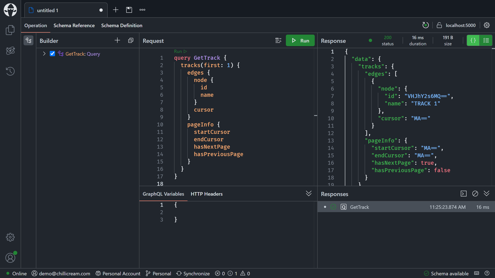
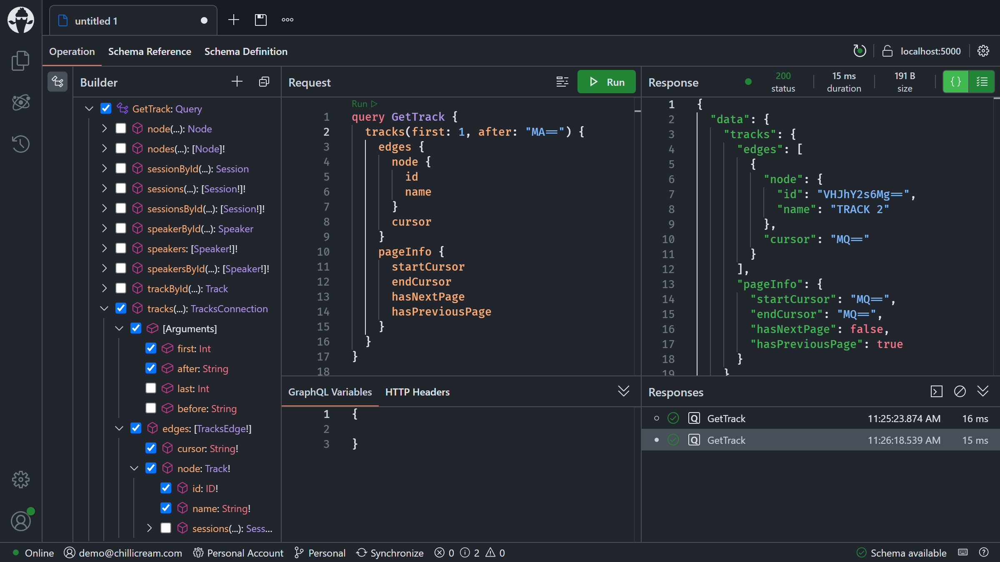
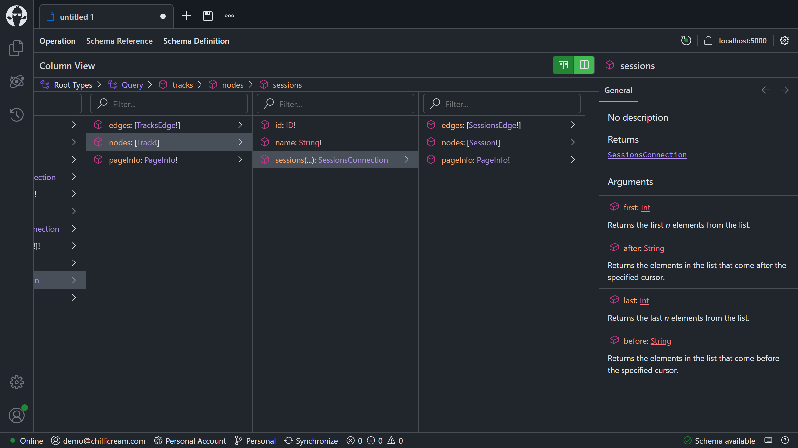
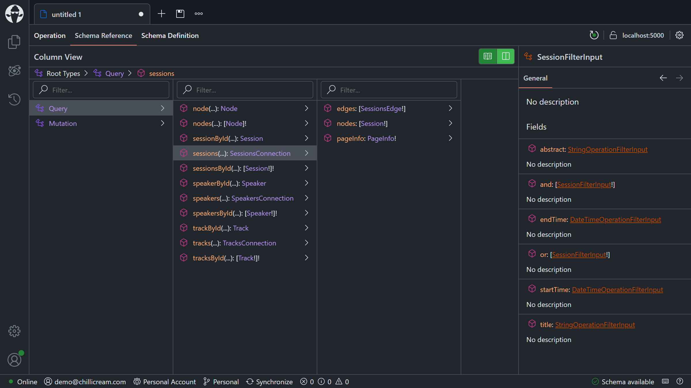

# Adding complex filter capabilities

- [Adding paging to your lists](#adding-paging-to-your-lists)
- [Adding filter capabilities to the top-level field `sessions`](#adding-filter-capabilities-to-the-top-level-field-sessions)
- [Summary](#summary)

So far, our GraphQL server only exposes plain lists that would, at some point, grow so large that our server would time out. Moreover, we are missing some filter capabilities for our session list so that the application using our backend can filter by title, or search the abstract for topics.

## Adding paging to your lists

Let's start by implementing the 2nd Relay server specification by adding Relay-compliant paging to our lists. In general, you should avoid plain lists wherever lists grow or are very large. Relay describes cursor-based paging where you can navigate between edges through their cursors. Cursor-based paging is ideal whenever you implement infinite scrolling solutions. In contrast to offset pagination, you cannot jump to a specific page, but you can jump to a particular cursor and navigate from there.

1. Add a reference to the NuGet package `HotChocolate.Data.EntityFramework` version `14.0.0`:
    - `dotnet add GraphQL package HotChocolate.Data.EntityFramework --version 14.0.0`

1. Add the cursor paging provider to the schema configuration in `Program.cs`:

    ```diff
      .AddMutationConventions()
    + .AddDbContextCursorPagingProvider()
      .AddGraphQLTypes();
    ```

    This will add a cursor paging provider that uses native [keyset pagination](https://use-the-index-luke.com/no-offset).

1. Head over to the `Tracks` directory and replace the `GetTracksAsync` resolver in the `TrackQueries.cs` file with the following code:

    ```csharp
    [UsePaging]
    public static IQueryable<Track> GetTracks(ApplicationDbContext dbContext)
    {
        return dbContext.Tracks.AsNoTracking().OrderBy(t => t.Name).ThenBy(t => t.Id);
    }
    ```

    The new resolver will return an `IQueryable` instead of executing the database query. The `IQueryable` is like a query builder. By applying the `UsePaging` middleware, we are rewriting the database query to only fetch the items that we need for our dataset.

    > Note: In order to use keyset pagination, we must always include a unique column in the ORDER BY clause (in this case, we also order by the primary key `Id`).

    The resolver pipeline for our field now looks like the following:

    

1. Start your GraphQL server:

    ```shell
    dotnet run --project GraphQL
    ```

1. Open Nitro, refresh the schema, and select the `Schema Reference` tab to see how our API structure has changed.

    

1. Define a simple query to fetch the first track:

    ```graphql
    query GetTrack {
      tracks(first: 1) {
        edges {
          node {
            id
            name
          }
          cursor
        }
        pageInfo {
          startCursor
          endCursor
          hasNextPage
          hasPreviousPage
        }
      }
    }
    ```

    

1. Take the cursor from this item and add a second argument `after`, with the value of the cursor:

    ```graphql
    query GetTrack {
      tracks(first: 1, after: "MA==") {
        edges {
          node {
            id
            name
          }
          cursor
        }
        pageInfo {
          startCursor
          endCursor
          hasNextPage
          hasPreviousPage
        }
      }
    }
    ```

    

1. Head over to the `SpeakerQueries.cs` file which is located in the `Speakers` directory, and replace the `GetSpeakersAsync` resolver with the following code:

    ```csharp
    [UsePaging]
    public static IQueryable<Speaker> GetSpeakers(ApplicationDbContext dbContext)
    {
        return dbContext.Speakers.AsNoTracking().OrderBy(s => s.Name).ThenBy(s => s.Id);
    }
    ```

1. Next, go to the `SessionQueries.cs` file in the `Sessions` directory, and replace the `GetSessionsAsync` resolver with the following code:

    ```csharp
    [UsePaging]
    public static IQueryable<Session> GetSessions(ApplicationDbContext dbContext)
    {
        return dbContext.Sessions.AsNoTracking().OrderBy(s => s.Title).ThenBy(s => s.Id);
    }
    ```

    We have now replaced all the root level list fields and are now using our pagination middleware. There are still more lists left where we should apply pagination if we want to really have a refined schema. Let's change the API a bit more to incorporate this.

1. Add a reference to the NuGet package `HotChocolate.Pagination.EntityFramework` version `14.0.0`:
    - `dotnet add GraphQL package HotChocolate.Pagination.EntityFramework --version 14.0.0`

1. Add paging arguments to the schema configuration in `Program.cs`:

    ```diff
      .AddDbContextCursorPagingProvider()
    + .AddPagingArguments()
      .AddGraphQLTypes();
    ```

    This will make paging arguments available to resolver methods.

1. Next, open the `TrackType.cs` file in the `Tracks` directory, and replace the `GetSessionsAsync` method with the following code:

    ```csharp
    [UsePaging]
    public static async Task<Connection<Session>> GetSessionsAsync(
        [Parent] Track track,
        ISessionsByTrackIdDataLoader sessionsByTrackId,
        PagingArguments pagingArguments,
        ISelection selection,
        CancellationToken cancellationToken)
    {
        return await sessionsByTrackId
            .WithPagingArguments(pagingArguments)
            .Select(selection)
            .LoadAsync(track.Id, cancellationToken)
            .ToConnectionAsync();
    }
    ```

    ```diff
      using HotChocolate.Execution.Processing;
    + using HotChocolate.Pagination;
    + using HotChocolate.Types.Pagination;
    ```

    Here, we apply the `[UsePaging]` attribute, and forward the paging arguments to the DataLoader. We also convert the returned `Page<T>` to a `Connection<T>`.

1. Next, open the `TrackDataLoaders.cs` file in the `Tracks` directory, and replace the `SessionsByTrackIdAsync` method with the following code:

    ```csharp
    [DataLoader]
    public static async Task<IReadOnlyDictionary<int, Page<Session>>> SessionsByTrackIdAsync(
        IReadOnlyList<int> trackIds,
        ApplicationDbContext dbContext,
        ISelectorBuilder selector,
        PagingArguments pagingArguments,
        CancellationToken cancellationToken)
    {
        return await dbContext.Sessions
            .AsNoTracking()
            .Where(s => s.TrackId != null && trackIds.Contains((int)s.TrackId))
            .OrderBy(s => s.Id)
            .Select(s => s.TrackId, selector)
            .ToBatchPageAsync(s => (int)s.TrackId!, pagingArguments, cancellationToken);
    }
    ```

    ```diff
      using GreenDonut.Selectors;
    + using HotChocolate.Pagination;
    ```

    Here, we use the `ToBatchPageAsync` method to return a page of sessions for each track ID.

1. Now go back to Nitro and refresh the schema.

    

1. Fetch a specific track and get the first session of this track:

    ```graphql
    query GetTrackWithSessions {
      trackById(id: "VHJhY2s6MQ==") {
        id
        sessions(first: 1) {
          nodes {
            title
          }
        }
      }
    }
    ```

    

## Adding filter capabilities to the top-level field `sessions`

Exposing rich filters to a public API can lead to unpredictable performance implications, but using filters wisely on select fields can make your API much better to use. In our conference API it would make almost no sense to expose filters on top of the `tracks` field since the `Track` type really only has one field `name`, and filtering on that really seems overkill. The `sessions` field on the other hand could be improved with filter capabilities. The user of our conference app could search for a session with a specific title or in a specific time window.

Filtering, like paging, is a middleware that can be applied on `IQueryable`. As mentioned in the middleware session, order is important with middleware. This means that our paging middleware has to execute last.


1. Add a reference to the NuGet package `HotChocolate.Data` version `14.0.0`:
    - `dotnet add GraphQL package HotChocolate.Data --version 14.0.0`

1. Add filtering and sorting conventions to the schema configuration in `Program.cs`:

    ```diff
      .AddPagingArguments()
    + .AddFiltering()
    + .AddSorting()
      .AddGraphQLTypes();
    ```

1. Head over to the `SessionQueries.cs` file which is located in the `Sessions` directory.

1. Replace the `GetSessions` resolver with the following code:

    ```csharp
    [UsePaging]
    [UseFiltering]
    [UseSorting]
    public static IQueryable<Session> GetSessions(ApplicationDbContext dbContext)
    {
        return dbContext.Sessions.AsNoTracking().OrderBy(s => s.Title).ThenBy(s => s.Id);
    }
    ```

    > By default, the filter middleware would infer a filter type that exposes all the fields of the entity. In our case, it would be better to be explicit, by specifying exactly which fields our users can filter by.

1. Create a new `SessionFilterInputType.cs` file in the `Sessions` directory, with the following code:

    ```csharp
    using ConferencePlanner.GraphQL.Data;
    using HotChocolate.Data.Filters;

    namespace ConferencePlanner.GraphQL.Sessions;

    public sealed class SessionFilterInputType : FilterInputType<Session>
    {
        protected override void Configure(IFilterInputTypeDescriptor<Session> descriptor)
        {
            descriptor.BindFieldsExplicitly();

            descriptor.Field(s => s.Title);
            descriptor.Field(s => s.Abstract);
            descriptor.Field(s => s.StartTime);
            descriptor.Field(s => s.EndTime);
        }
    }
    ```

    We use the descriptor to set the binding mode to explicit, and to expose the specific fields that we're interested in.

1. Start your GraphQL server:

    ```shell
    dotnet run --project GraphQL
    ```

1. Open Nitro, refresh the schema, and select the `Schema Reference` tab.

    

    > We now have an argument named `where` on our field that exposes a rich filter type.

1. Write the following query to look for the session with the title `Session 2`:

    ```graphql
    query GetSession2 {
      sessions(
        first: 1
        where: {
          title: { eq: "Session 2" }
        }
      ) {
        nodes {
          title
        }
      }
    }
    ```

    

## Summary

With cursor-based pagination, we've introduced a strong pagination concept and also put the last piece in to be fully Relay compliant. We've learned that we can page within a paged result; in fact, we can create large paging hierarchies.

Further, we've looked at filtering where we can apply a simple middleware that infers from our data model a powerful filter structure. Filters are rewritten into native database queries on top of `IQueryable` but can also be applied to in-memory lists. Use filters where they make sense, and control them by providing filter types that limit what a user can do, to keep performance predictable.

[**<< Session #4 - Understanding middleware**](4-understanding-middleware.md) | [**Session #6 - Adding real-time functionality with subscriptions >>**](6-subscriptions.md)
