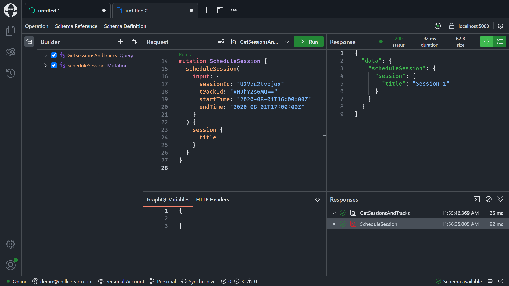
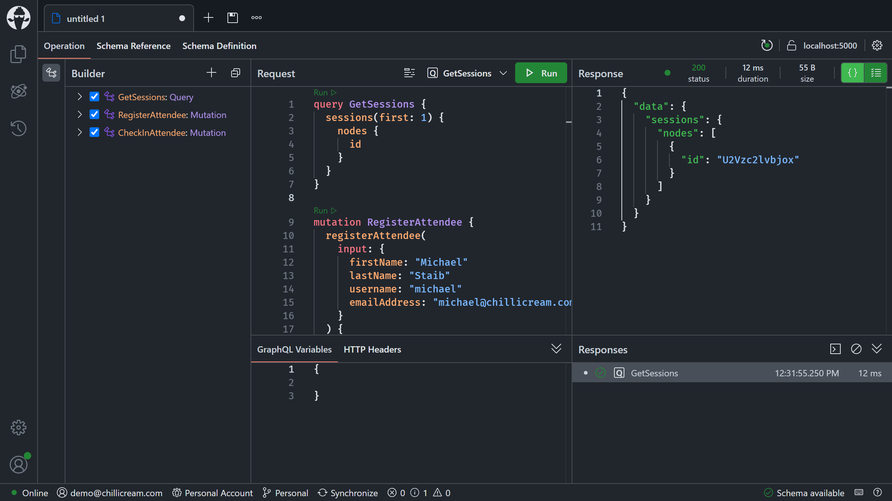

# Adding real-time functionality with subscriptions

- [Adding to our GraphQL API](#adding-to-our-graphql-api)
  - [Adding a `registerAttendee` mutation](#adding-a-registerattendee-mutation)
  - [Adding a `checkInAttendee` mutation](#adding-a-checkinattendee-mutation)
- [Adding an `onSessionScheduled` subscription](#adding-an-onsessionscheduled-subscription)
- [Adding an `onAttendeeCheckedIn` subscription](#adding-an-onattendeecheckedin-subscription)
- [Summary](#summary)

For the last few parts of our journey through GraphQL, we've dealt with queries and mutations. In many APIs, this is all that people need or want, but GraphQL also offers us real-time capabilities where we can formulate what data we want to receive when a specific event occurs.

For our conference API, we'd like to introduce two events that a user can subscribe to. Firstly, whenever a session is scheduled, we want to be notified. An `onSessionScheduled` event would allow us to send the user notifications whenever a new session is available, or whenever a schedule for a specific session has changed.

The second case that we have for subscriptions is whenever a user checks in to a session, we want to raise a subscription so that we can notify users that the space in a session is running low or even have some analytics tool subscribe to this event.

## Adding to our GraphQL API

Before we can start with introducing our new subscriptions, we need to first bring in some new types.

1. Create a new class named `AttendeeQueries`, in the `Attendees` directory, with the following content:

    ```csharp
    using ConferencePlanner.GraphQL.Data;
    using Microsoft.EntityFrameworkCore;

    namespace ConferencePlanner.GraphQL.Attendees;

    [QueryType]
    public static class AttendeeQueries
    {
        [UsePaging]
        public static IQueryable<Attendee> GetAttendees(ApplicationDbContext dbContext)
        {
            return dbContext.Attendees.AsNoTracking().OrderBy(a => a.Username);
        }

        [NodeResolver]
        public static async Task<Attendee?> GetAttendeeByIdAsync(
            int id,
            IAttendeeByIdDataLoader attendeeById,
            CancellationToken cancellationToken)
        {
            return await attendeeById.LoadAsync(id, cancellationToken);
        }

        public static async Task<IEnumerable<Attendee>> GetAttendeesByIdAsync(
            [ID<Attendee>] int[] ids,
            IAttendeeByIdDataLoader attendeeById,
            CancellationToken cancellationToken)
        {
            return await attendeeById.LoadRequiredAsync(ids, cancellationToken);
        }
    }
    ```

### Adding a `registerAttendee` mutation

We now have the base types integrated and can start adding the attendee mutations. We'll begin by adding in the `registerAttendee` mutation.

1. Add a new class named `RegisterAttendeeInput` to the `Attendees` directory:

    ```csharp
    namespace ConferencePlanner.GraphQL.Attendees;

    public sealed record RegisterAttendeeInput(
        string FirstName,
        string LastName,
        string Username,
        string EmailAddress);
    ```

1. Add an `AttendeeMutations` class with a `RegisterAttendeeAsync` resolver to the `Attendees` directory:

    ```csharp
    using ConferencePlanner.GraphQL.Data;

    namespace ConferencePlanner.GraphQL.Attendees;

    [MutationType]
    public static class AttendeeMutations
    {
        public static async Task<Attendee> RegisterAttendeeAsync(
            RegisterAttendeeInput input,
            ApplicationDbContext dbContext,
            CancellationToken cancellationToken)
        {
            var attendee = new Attendee
            {
                FirstName = input.FirstName,
                LastName = input.LastName,
                Username = input.Username,
                EmailAddress = input.EmailAddress
            };

            dbContext.Attendees.Add(attendee);

            await dbContext.SaveChangesAsync(cancellationToken);

            return attendee;
        }
    }
    ```

### Adding a `checkInAttendee` mutation

Now that we have the mutation in to register new attendees, let's move on to adding another mutation that will allow us to check a user into a session.

1. Add a `CheckInAttendeeInput` record to the `Attendees` directory:

    ```csharp
    using ConferencePlanner.GraphQL.Data;

    namespace ConferencePlanner.GraphQL.Attendees;

    public sealed record CheckInAttendeeInput(
        [property: ID<Session>] int SessionId,
        [property: ID<Attendee>] int AttendeeId);
    ```

1. Add an `AttendeeExceptions.cs` file to the `Attendees` directory, with the following code:

    ```csharp
    namespace ConferencePlanner.GraphQL.Attendees;

    public sealed class AttendeeNotFoundException() : Exception("Attendee not found.");
    ```

1. Head back to the `AttendeeMutations` class in the `Attendees` directory, and add the `CheckInAttendeeAsync` resolver to it:

    ```csharp
    public static async Task<Attendee> CheckInAttendeeAsync(
        CheckInAttendeeInput input,
        ApplicationDbContext dbContext,
        CancellationToken cancellationToken)
    {
        var attendee = await dbContext.Attendees.FirstOrDefaultAsync(
            a => a.Id == input.AttendeeId,
            cancellationToken);

        if (attendee is null)
        {
            throw new AttendeeNotFoundException();
        }

        attendee.SessionsAttendees.Add(new SessionAttendee { SessionId = input.SessionId });

        await dbContext.SaveChangesAsync(cancellationToken);

        return attendee;
    }
    ```

1. Start your GraphQL server:

    ```shell
    dotnet run --project GraphQL
    ```

1. Validate that you see your new queries and mutations with Banana Cake Pop.

## Adding an `onSessionScheduled` subscription

With the base in, we can now focus on putting subscriptions in our GraphQL server. GraphQL subscriptions by default work over WebSockets but could also work over SignalR or gRPC. We'll first update our request pipeline to use WebSockets, and then we'll set up the subscription pub/sub system. After having our server prepared, we'll add the subscriptions to our API.

1. Update the `docker-compose.yml` file with a new Redis service:

    ```yaml
    graphql-workshop-redis:
      container_name: graphql-workshop-redis
      image: redis:7.4
      networks: [graphql-workshop]
      ports: [6379:6379]
      volumes:
        - type: volume
          source: redis-data
          target: /data
    ```

    ```diff
     volumes:
       postgres-data:
    +  redis-data:
    ```

1. Add a reference to the NuGet package `HotChocolate.Subscriptions.Redis` version `14.0.0-p.174`:
    - `dotnet add GraphQL package HotChocolate.Subscriptions.Redis --version 14.0.0-p.174`

1. Head over to `Program.cs` and add `app.UseWebSockets()` to the request pipeline. Middleware order is also important with ASP.NET Core, so this middleware needs to come before the GraphQL middleware:

    ```diff
    + app.UseWebSockets();
      app.MapGraphQL();
    ```

1. Stay in the `Program.cs` file and add Redis subscriptions to the GraphQL configuration:

    ```diff
      .AddSorting()
    + .AddRedisSubscriptions(_ => ConnectionMultiplexer.Connect("127.0.0.1:6379"))
      .AddGraphQLTypes();
    ```

    With `app.UseWebSockets()` we've enabled our server to handle websocket requests. With `AddRedisSubscriptions(...)` we've added a Redis pub/sub system for GraphQL subscriptions to our schema.

1. Add a new class named `SessionSubscriptions` to the `Sessions` directory:

    ```csharp
    using ConferencePlanner.GraphQL.Data;

    namespace ConferencePlanner.GraphQL.Sessions;

    [SubscriptionType]
    public static class SessionSubscriptions
    {
        [Subscribe]
        [Topic]
        public static async Task<Session> OnSessionScheduledAsync(
            [EventMessage] int sessionId,
            ISessionByIdDataLoader sessionById,
            CancellationToken cancellationToken)
        {
            return await sessionById.LoadRequiredAsync(sessionId, cancellationToken);
        }
    }
    ```

    The `[Subscribe]` attribute tells the schema builder that this resolver method needs to be hooked up to the pub/sub system. This means that in the background, the resolver compiler will create a so-called subscribe resolver that handles subscribing to the pub/sub system.

    The `[Topic]` attribute can be put on the method or a parameter of the method and will infer the pub/sub topic for this subscription.

    The `[EventMessage]` attribute marks the parameter where the execution engine will inject the message payload of the pub/sub system.

    The subscription type itself is automatically registered, but we still need something to trigger the event. So next, we are going to update our `scheduleSession` resolver to trigger an event.

1. Head over to the `SessionMutations` class in the `Sessions` directory and replace `ScheduleSessionAsync` with the following code:

    ```csharp
    [Error<EndTimeInvalidException>]
    [Error<SessionNotFoundException>]
    public static async Task<Session> ScheduleSessionAsync(
        ScheduleSessionInput input,
        ApplicationDbContext dbContext,
        ITopicEventSender eventSender,
        CancellationToken cancellationToken)
    {
        if (input.EndTime < input.StartTime)
        {
            throw new EndTimeInvalidException();
        }

        var session = await dbContext.Sessions.FindAsync([input.SessionId], cancellationToken);

        if (session is null)
        {
            throw new SessionNotFoundException();
        }

        session.TrackId = input.TrackId;
        session.StartTime = input.StartTime;
        session.EndTime = input.EndTime;

        await dbContext.SaveChangesAsync(cancellationToken);

        await eventSender.SendAsync(
            nameof(SessionSubscriptions.OnSessionScheduledAsync),
            session.Id,
            cancellationToken);

        return session;
    }
    ```

    Our improved resolver now injects `ITopicEventSender eventSender`. This gives us access to send messages to the underlying pub/sub system.

    After `await dbContext.SaveChangesAsync(cancellationToken);`, we are sending a new message.

    ```csharp
    await eventSender.SendAsync(
        nameof(SessionSubscriptions.OnSessionScheduledAsync),
        session.Id,
        cancellationToken);
    ```

    Since we added the `[Topic]` attribute on our resolver method in the `SessionSubscriptions` class, the topic is now the name of this method. A topic can be anything that can be serialized and has equality implemented so you could also use an object.

1. Start your GraphQL server:

    ```shell
    dotnet run --project GraphQL
    ```

1. Open Banana Cake Pop and refresh the schema.

1. Open a new query tab and add the following subscription query:

    ```graphql
    subscription {
      onSessionScheduled {
        title
        startTime
      }
    }
    ```

    Execute the subscription query. Nothing will happen at this point, and you'll just see a loading indicator.

    

1. Open another tab in Banana Cake Pop and add the following document:

    ```graphql
    query GetSessionsAndTracks {
      sessions(first: 1) {
        nodes {
          id
        }
      }
      tracks(first: 1) {
        nodes {
          id
        }
      }
    }

    mutation ScheduleSession {
      scheduleSession(
        input: {
          sessionId: "U2Vzc2lvbjox"
          trackId: "VHJhY2s6MQ=="
          startTime: "2020-08-01T16:00:00Z"
          endTime: "2020-08-01T17:00:00Z"
        }
      ) {
        session {
          title
        }
      }
    }
    ```

    Execute `GetSessionsAndTracks` first by clicking the `Run` link above it. Use the IDs from the response for `ScheduleSession` and execute it once you have filled in the correct IDs.

    

1. Return to the first query tab (the tab where you specified the subscription query).

    

    The event was raised, and our subscription query was executed. We can also see that the loading indicator is still turning since we are still subscribed, and we'll get new responses whenever the event is raised. With GraphQL a subscription stream can be infinite or finite. A finite stream will automatically complete whenever the server chooses to complete the topic (`ITopicEventSender.CompleteAsync`).

    To stop the subscription from the client side, click on the `Cancel` button.

## Adding an `onAttendeeCheckedIn` subscription

The `onSessionScheduled` subscription was quite simple since we didn't subscribe to a dynamic topic. A dynamic topic refers to a topic that is defined at the moment we subscribe to it, or a topic that depends on the user context. With `onAttendeeCheckedIn`, we'll subscribe to a specific session to see who checked in and how quickly it fills up.

1. Head over to the `AttendeeMutations` class and replace the `CheckInAttendeeAsync` resolver with the following code:

    ```csharp
    public static async Task<Attendee> CheckInAttendeeAsync(
        CheckInAttendeeInput input,
        ApplicationDbContext dbContext,
        ITopicEventSender eventSender,
        CancellationToken cancellationToken)
    {
        var attendee = await dbContext.Attendees.FirstOrDefaultAsync(
            a => a.Id == input.AttendeeId,
            cancellationToken);

        if (attendee is null)
        {
            throw new AttendeeNotFoundException();
        }

        attendee.SessionsAttendees.Add(new SessionAttendee { SessionId = input.SessionId });

        await dbContext.SaveChangesAsync(cancellationToken);

        await eventSender.SendAsync(
            $"OnAttendeeCheckedIn_{input.SessionId}",
            input.AttendeeId,
            cancellationToken);

        return attendee;
    }
    ```

    In this instance, we are again using our `ITopicEventSender` to send messages to our pub/sub system. However, we are now creating a string topic that includes the session ID. If nobody is subscribed, the messages will just be dropped.

    ```csharp
    await eventSender.SendAsync(
        $"OnAttendeeCheckedIn_{input.SessionId}",
        input.AttendeeId,
        cancellationToken);
    ```

1. Add a new class named `SessionAttendeeCheckIn` to the `Attendees` directory. This will be our subscription payload:

    ```csharp
    using Microsoft.EntityFrameworkCore;
    using ConferencePlanner.GraphQL.Data;
    using ConferencePlanner.GraphQL.Sessions;

    namespace ConferencePlanner.GraphQL.Attendees;

    public sealed class SessionAttendeeCheckIn(int attendeeId, int sessionId)
    {
        [ID<Attendee>]
        public int AttendeeId { get; } = attendeeId;

        [ID<Session>]
        public int SessionId { get; } = sessionId;

        public async Task<int> CheckInCountAsync(
            ApplicationDbContext dbContext,
            CancellationToken cancellationToken)
        {
            return await dbContext.Sessions
                .AsNoTracking()
                .Where(s => s.Id == SessionId)
                .SelectMany(s => s.SessionAttendees)
                .CountAsync(cancellationToken);
        }

        public async Task<Attendee> GetAttendeeAsync(
            IAttendeeByIdDataLoader attendeeById,
            CancellationToken cancellationToken)
        {
            return await attendeeById.LoadRequiredAsync(AttendeeId, cancellationToken);
        }

        public async Task<Session> GetSessionAsync(
            ISessionByIdDataLoader sessionById,
            CancellationToken cancellationToken)
        {
            return await sessionById.LoadRequiredAsync(SessionId, cancellationToken);
        }
    }
    ```

1. Create a new class named `AttendeeSubscriptions` and put it in the `Attendees` directory:

    ```csharp
    using ConferencePlanner.GraphQL.Data;
    using HotChocolate.Execution;
    using HotChocolate.Subscriptions;

    namespace ConferencePlanner.GraphQL.Attendees;

    [SubscriptionType]
    public static class AttendeeSubscriptions
    {
        [Subscribe(With = nameof(SubscribeToOnAttendeeCheckedInAsync))]
        public static SessionAttendeeCheckIn OnAttendeeCheckedIn(
            [ID<Session>] int sessionId,
            [EventMessage] int attendeeId)
        {
            return new SessionAttendeeCheckIn(attendeeId, sessionId);
        }

        public static async ValueTask<ISourceStream<int>> SubscribeToOnAttendeeCheckedInAsync(
            int sessionId,
            ITopicEventReceiver eventReceiver,
            CancellationToken cancellationToken)
        {
            return await eventReceiver.SubscribeAsync<int>(
                $"OnAttendeeCheckedIn_{sessionId}",
                cancellationToken);
        }
    }
    ```

    `OnAttendeeCheckedIn` represents our resolver like in the first subscription that we built, but now in our `Subscribe` attribute we are referring to a method named `SubscribeToOnAttendeeCheckedInAsync`. So, instead of letting the system generate a subscribe resolver that handles subscribing to the pub/sub system, we are creating it ourselves in order to control how it's done, or to filter out events that we don't want to pass down.

    ```csharp
    public static async ValueTask<ISourceStream<int>> SubscribeToOnAttendeeCheckedInAsync(
        int sessionId,
        ITopicEventReceiver eventReceiver,
        CancellationToken cancellationToken)
    {
        return await eventReceiver.SubscribeAsync<int>(
            $"OnAttendeeCheckedIn_{sessionId}",
            cancellationToken);
    }
    ```

    The subscribe resolver is using `ITopicEventReceiver` to subscribe to a topic. A subscribe resolver can return `IAsyncEnumerable<T>`, `IEnumerable<T>`, or `IObservable<T>` to represent the subscription stream. The subscribe resolver has access to all of the arguments that the actual resolver has access to.

1. Start your GraphQL server again:

    ```shell
    dotnet run --project GraphQL
    ```

1. Open a new tab and add the following document:

    ```graphql
    query GetSessions {
      sessions(first: 1) {
        nodes {
          id
        }
      }
    }

    mutation RegisterAttendee {
      registerAttendee(
        input: {
          firstName: "Michael"
          lastName: "Staib"
          username: "michael"
          emailAddress: "michael@chillicream.com"
        }
      ) {
        attendee {
          id
        }
      }
    }

    mutation CheckInAttendee {
      checkInAttendee(
        input: {
          attendeeId: "QXR0ZW5kZWU6MQ=="
          sessionId: "U2Vzc2lvbjox"
        }
      ) {
        attendee {
          username
        }
      }
    }
    ```

    Execute `GetSessions` first, take the resulting session ID, and feed it into the `CheckInAttendee` operation.

    

    Next, execute `RegisterAttendee`, take the resulting attendee ID, and feed it into the `CheckInAttendee` operation.

    

1. Open another tab in Banana Cake Pop and add the following document:

    ```graphql
    subscription OnAttendeeCheckedIn {
      onAttendeeCheckedIn(sessionId: "U2Vzc2lvbjox") {
        checkInCount
        attendee {
          username
        }
      }
    }
    ```

    Take the session ID that you gathered earlier and pass it into the `sessionId` argument of `OnAttendeeCheckedIn`.

    Execute `OnAttendeeCheckedIn`. Again, nothing will happen at this point, and the query tab is just waiting for incoming messages.

    

1. Go back to the previous tab and execute the `CheckInAttendee` operation.

    

1. Click on the 2nd tab to verify that we've received the message that an attendee has checked into our session.

    

## Summary

In this session, we've learned how we can use GraphQL subscriptions to provide real-time events. GraphQL makes it easy to work with real-time data since we can specify what data we want to receive when an event occurs in our system.

[**<< Session #5 - Adding complex filter capabilities**](5-adding-complex-filter-capabilities.md) | [**Session #7 - Testing the GraphQL server >>**](7-testing-the-graphql-server.md)

<!-- spellchecker:ignore U2Vzc2lvbjox -->
