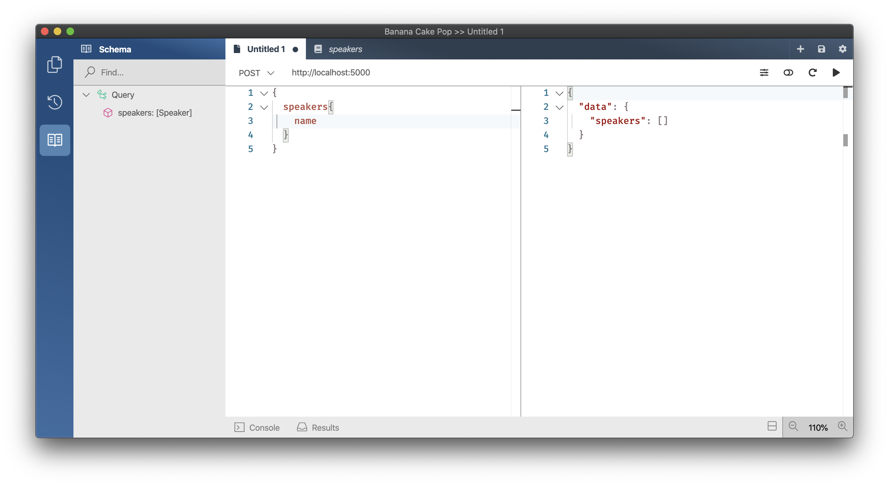

# Creating a new GraphQL server project

1. Create a new project for our GraphQL Server.
   1. `dotnet new sln -n ConferencePlanner`
   1. `dotnet new web -n GraphQL`
   1. `dotnet sln add GraphQL`
1. Add a new folder `Data` where we want to place all our database related code.
   1. `cd GraphQL`
   1. `mkdir Data`
1. Add a new Speaker class using the following code:

   ```csharp
    using System;
    using System.Collections.Generic;
    using System.ComponentModel.DataAnnotations;
    using System.Linq;
    using System.Threading.Tasks;

    namespace ConferencePlanner.GraphQL.Data
    {
        public class Speaker
        {
            public int Id { get; set; }

            [Required]
            [StringLength(200)]
            public string Name { get; set; }

            [StringLength(4000)]
            public string Bio { get; set; }

            [StringLength(1000)]
            public virtual string WebSite { get; set; }
        }
    }
   ```

1. Add a reference to the NuGet package package `Microsoft.EntityFrameworkCore.Sqlite` version `3.1.6`.
   1. `dotnet add package Microsoft.EntityFrameworkCore.Sqlite --version 3.1.6`
1. Next we'll create a new Entity Framework DbContext. Create a new `ApplicationDbContext` class in the `Data` folder using the following code:

    ```csharp
    using Microsoft.EntityFrameworkCore;

    namespace ConferencePlanner.GraphQL.Data
    {
        public class ApplicationDbContext : DbContext
        {
            public ApplicationDbContext(DbContextOptions<ApplicationDbContext> options)
                : base(options)
            {

            }

            public DbSet<Speaker> Speakers { get; set; }
        }
    }
    ```

## Register the DB Context Service

1. Add the following code to the top of the `ConfigureServices()` method in `Startup.cs`:

    ```csharp
    services.AddDbContext<ApplicationDbContext>(options => options.UseSqlite("Data Source=conferences.db"));
    ```

    > This code registers the `ApplicationDbContext` service so it can be injected into resolvers.

## Configuring EF Migrations

1. Add a reference to the NuGet package `Microsoft.EntityFrameworkCore.Tools` version `3.1.6`.
   1. `dotnet add package Microsoft.EntityFrameworkCore.Tools --version 3.1.6`

### Visual Studio: Package Manager Console

1. In Visual Studio, select the Tools -> NuGet Package Manager -> Package Manager Console

1. Run the following commands in the Package Manager Console

   ```console
   Add-Migration Initial
   Update-Database
   ```

### Command line

1. Install the EntityFramework global tool `dotnet-ef` using the following command:

   ```console
   dotnet new tool-manifest
   dotnet tool install dotnet-ef --version 3.1.6 --local
   ```

2. Open a command prompt and navigate to the project directory. (The directory containing the `Startup.cs` file).

3. Run the following commands in the command prompt:

    ```console
    dotnet build
    dotnet ef migrations add Initial
    dotnet ef database update
    ```

Commands Explained

| Command                                                      | Description                                                                                                                                             |
| ------------------------------------------------------------ | ------------------------------------------------------------------------------------------------------------------------------------------------------- |
| `dotnet ef migrations add Initial` / `Add-Migration Initial` | generates code to create the initial database schema based on the model specified in 'ApplicationDbContext.cs'. `Initial` is the name of the migration. |
| `dotnet ef database update` / `Update-Database`              | creates the database                                                                                                                                    |

> If your database ever gets in a bad state and you'd like to reset things, you can use `dotnet ef database drop` followed by `dotnet ef database update` to remove your database and run all migrations again.

## Adding GraphQL

1. Add a reference to the NuGet package package `HotChocolate.AspNetCore` version `10.5.0`.
   1. `dotnet add package HotChocolate.AspNetCore --version 10.5.0`
1. Next we'll create our query root type and add a resolver that fetches all of our speakers.

    ```csharp
    using System.Linq;
    using HotChocolate;
    using ConferencePlanner.GraphQL.Data;

    namespace ConferencePlanner.GraphQL
    {
        public class Query
        {
            public IQueryable<Speaker> GetSpeakers([Service] ApplicationDbContext context) =>
                context.Speakers;
        }
    }
    ```

1. Before we can do anything with our query root type we need to setup GraphQL and register our query root type. Add the following code below `AddDbContext` in the `ConfigureServices()` method in `Startup.cs`:

    ```csharp
    services.AddGraphQL(
        SchemaBuilder.New()
            .AddQueryType<Query>());
    ```

    > The above code registers a GraphQL schema with our dependency injection and with that registers our `Query` type.

1. Next we need to configure our GraphQL middleware so that the server knows how to execute GraphQL requests. For this add the following code after `app.UseRouting();` to the `Configure(IApplicationBuilder app, IWebHostEnvironment env)`method in `Startup.cs`

    ```csharp
    app.UseGraphQL();
    ```

    > Your Startup.cs should now look like the following:

    ```csharp
    using System;
    using System.Collections.Generic;
    using System.Threading.Tasks;
    using Microsoft.AspNetCore.Builder;
    using Microsoft.AspNetCore.Hosting;
    using Microsoft.AspNetCore.Http;
    using Microsoft.EntityFrameworkCore;
    using Microsoft.Extensions.DependencyInjection;
    using Microsoft.Extensions.Hosting;
    using ConferencePlanner.GraphQL.Data;
    using HotChocolate.AspNetCore;
    using HotChocolate;

    namespace GraphQL
    {
        public class Startup
        {
            // This method gets called by the runtime. Use this method to add services to the container.
            // For more information on how to configure your application, visit https://go.microsoft.com/fwlink/?LinkID=398940
            public void ConfigureServices(IServiceCollection services)
            {
                services.AddDbContext<ApplicationDbContext>(options => options.UseSqlite("Data Source=conferences.db"));

                services.AddGraphQL(
                    SchemaBuilder.New()
                        .AddQueryType<Query>());
            }

            // This method gets called by the runtime. Use this method to configure the HTTP request pipeline.
            public void Configure(IApplicationBuilder app, IWebHostEnvironment env)
            {
                if (env.IsDevelopment())
                {
                    app.UseDeveloperExceptionPage();
                }

                app.UseRouting();

                app.UseGraphQL();

                app.UseEndpoints(endpoints =>
                {
                    endpoints.MapGet("/", async context =>
                    {
                        await context.Response.WriteAsync("Hello World!");
                    });
                });
            }
        }
    }
    ```

1. Start the server.
   1. `dotnet run --project GraphQL`

    

    
    
    

    