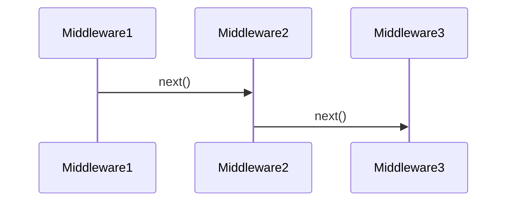

# Middleware flow

---

[Mermaid Live Editor](https://mermaid.live/edit#pako:eNpVjzFPwzAQhf9K9CaQTIWdNHE8dGLtxIa8WPHRRq3t4tqiJcp_xxQF1O0-6Xt39yYMwRIUzvSRyQ_0MppdNE77qtqO1h7p00TiT5vNPwlVebqkh8d7SdxJ9SKBwVF0ZrTlyvQT0Uh7cqShymhNPGhoPxfP5BRer36ASjETQwx5t4d6N8dzoXyyJi3_LQrZMYW4_e1wq8JwMv4tBPcXLAw14QLVrFe8EbLrG9k-y7qXDcMVqpMr3nW87oUUQrTrdmb4um3g8zfkh1w0) (export SVG)
