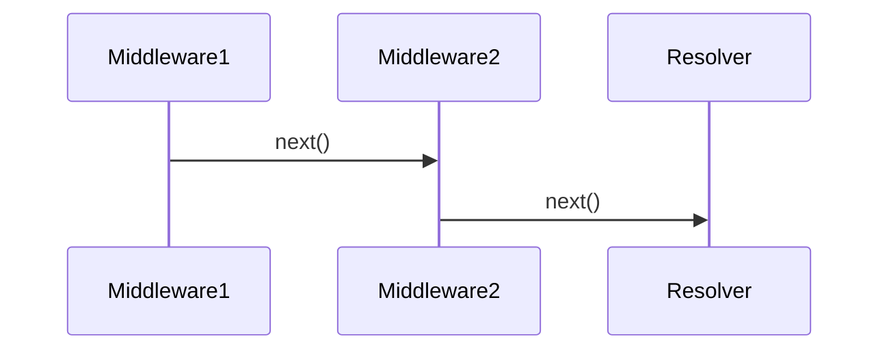

# Middleware flow

---

[Mermaid Live Editor](https://mermaid.live/edit#pako:eNpVjzFPwzAQhf9K9CaQTIXdNHE8dOraBTbkxYqPNmpit44NLVH-O6aoVGz3nT69uzeh9ZagMNIpkWtp05ldMIN2RbHtrO3p0wTiT-v1nYQqHJ3jw-N_SWTphUbff1C4GWAYKAyms_nE9ONrxD0NpKHyaE04aGg3Z8-k6F8vroWKIRFD8Gm3h3o3_ZgpHa2Jt-f-tmS76MP2t8G1CMPRuDfv705mqAlnqHK14KWQdVPK6lkuG1kyXKBqueB1zZeNkEKIalXNDF_XBD5_AzdyW6A) (export SVG)
