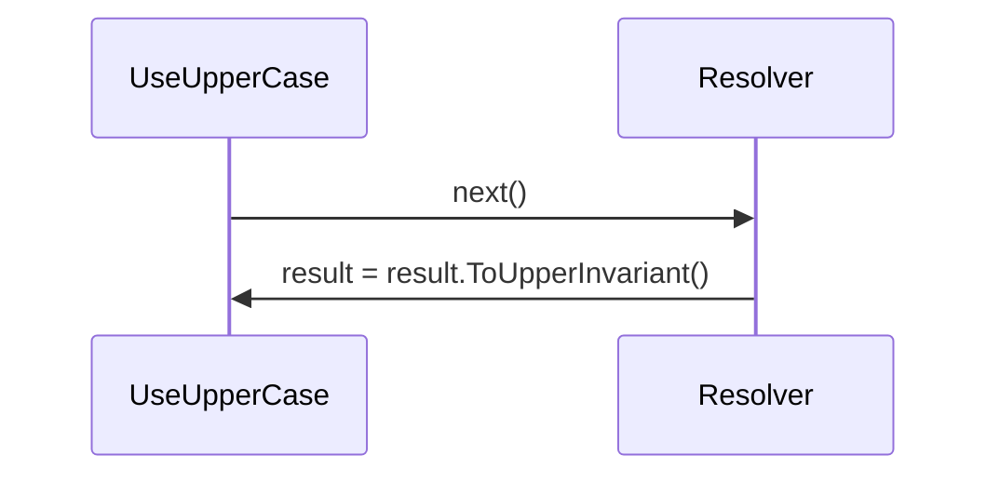

# Middleware flow

---

[Mermaid Live Editor](https://mermaid.live/edit#pako:eNpNTz1PwzAQ_SvWTVQyEXHTxLHULrAwsABdUJZTcrQRiR38UbVE-e-4gVK2ex_37t4ItWkIFDj6DKRremhxZ7GvNGNbR9thIHuPjm43m2dypjuQVUzT0d8szpYLF-X_bsUsudB5tv4dklczi4_6gLZFHdeBQ0-2x7aJ18dzWAV-Tz1VoOLYoP2ooNJT9GHw5uWka1DeBuJgTdjtQb1j5yIKQ4P-8vcfS03rjX36KTd35DCgfjPm6okY1AhHUNkqSTMhizKT-Z1cljLjcAJVyCQtinRZCimEyFf5xOFrTkinb4cBZnI) (export SVG)
