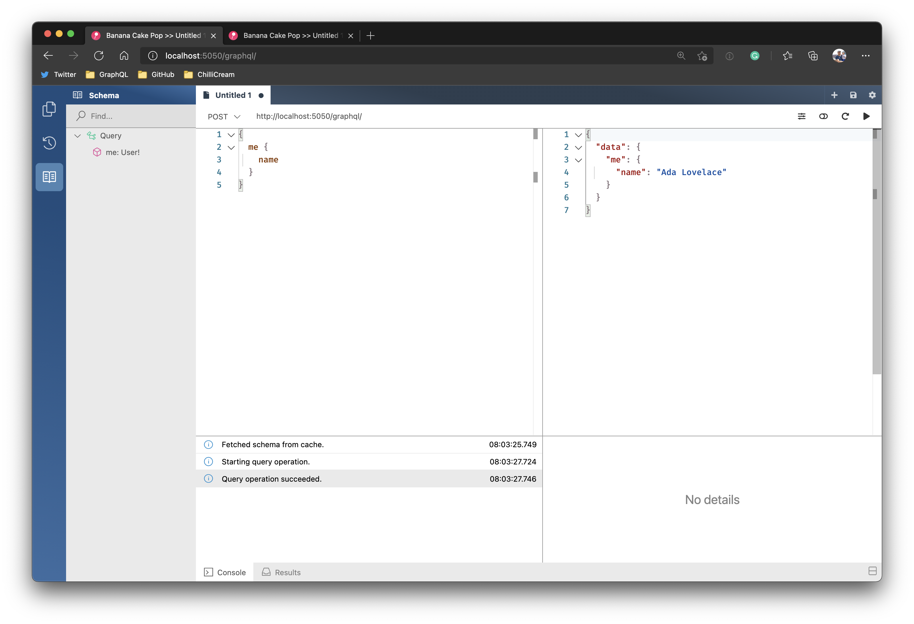
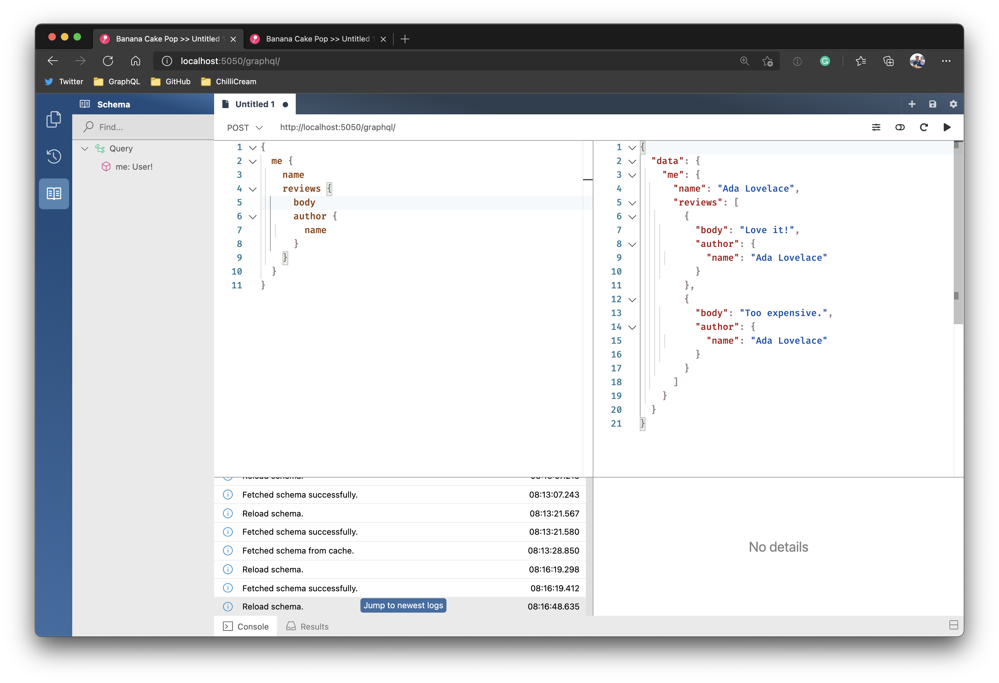
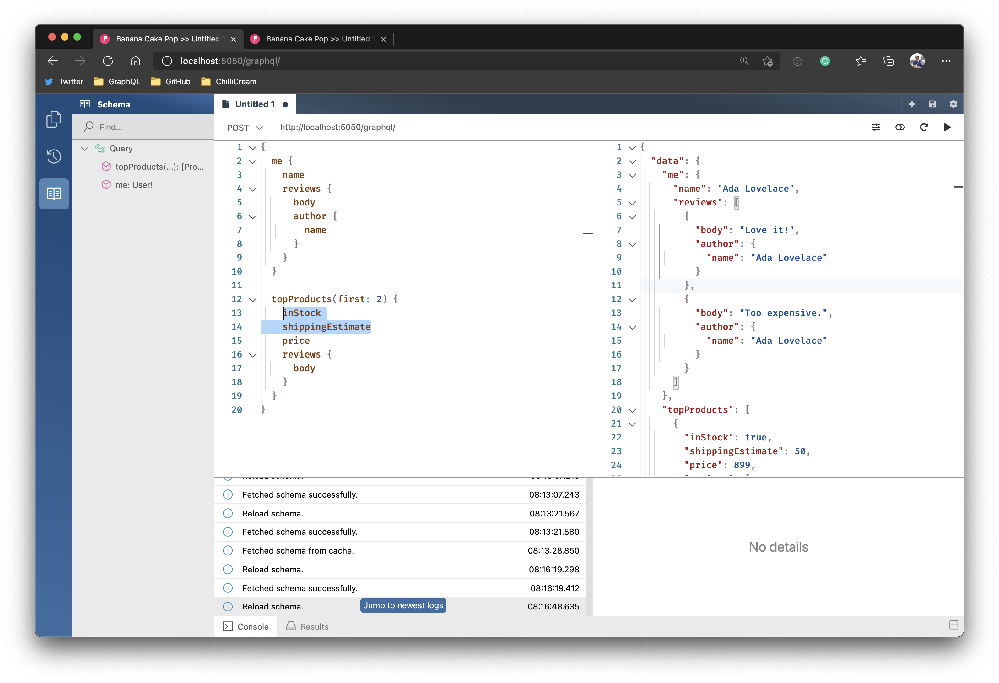
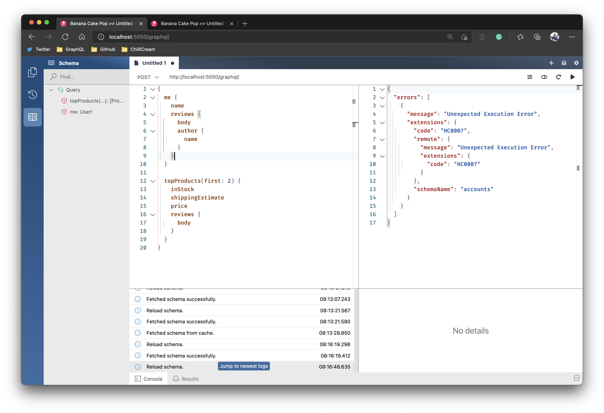
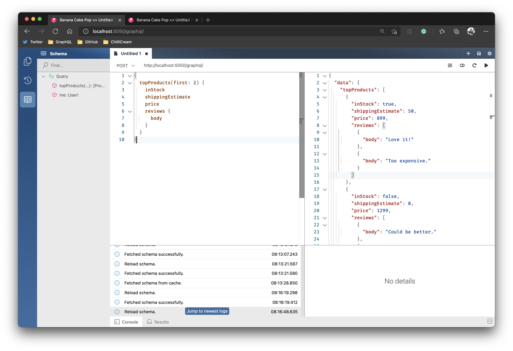
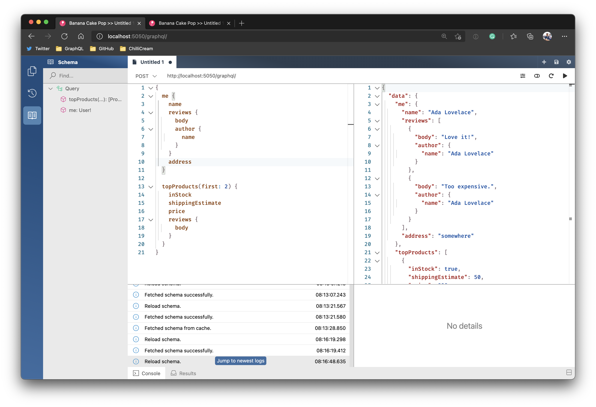

# Create a basic GraphQL gateway

## Create server project

1. Create a new project for our GraphQL gateway.
   1. `dotnet new web -n gateway`
   1. `dotnet sln add gateway`

## Add GraphQL and Stitching

1. Add a reference to the NuGet package package `HotChocolate.AspNetCore` version `11.0.8`.
   1. `dotnet add gateway package HotChocolate.AspNetCore --version 11.0.8`
1. Add a reference to the NuGet package package `HotChocolate.Stitching.Redis` version `11.0.8`.
   1. `dotnet add gateway package HotChocolate.Stitching.Redis --version
1. Add a reference to the NuGet package package `HotChocolate.Stitching.Redis` version `11.0.8` to all downstream services.
   1. `dotnet add accounts package HotChocolate.Stitching.Redis --version 11.0.8`
   1. `dotnet add inventory package HotChocolate.Stitching.Redis --version 11.0.8`
   1. `dotnet add products package HotChocolate.Stitching.Redis --version 11.0.8`
   1. `dotnet add reviews package HotChocolate.Stitching.Redis --version 11.0.8`

## Configure basic gateway.

1. Head over to the `Startup.cs` and add the following constants that shall represent our downstream services.

   ```csharp
   public const string Accounts = "accounts";
   public const string Inventory = "inventory";
   public const string Products = "products";
   public const string Reviews = "reviews";
   ```

1. Next, we need to configure HTTP connections for each downstream service.

   ```csharp
   public void ConfigureServices(IServiceCollection services)
   {
      services.AddHttpClient(Accounts, c => c.BaseAddress = new Uri("http://localhost:5051/graphql"));
      services.AddHttpClient(Inventory, c => c.BaseAddress = new Uri("http://localhost:5052/graphql"));
      services.AddHttpClient(Products, c => c.BaseAddress = new Uri("http://localhost:5053/graphql"));
      services.AddHttpClient(Reviews, c => c.BaseAddress = new Uri("http://localhost:5054/graphql"));
   }
   ```

1. Since, we are using a federated approach and want a reliable gateway we will use Redis to hold the schema configurations. For this we need to add a Redis `ConnectionMultiplexer`.

   ```csharp
   services.AddSingleton(ConnectionMultiplexer.Connect("localhost:7000"));
   ```

1. Last, we need to add the GraphQL server configuration.

   ```csharp
   public void ConfigureServices(IServiceCollection services)
   {
      services.AddHttpClient(Accounts, c => c.BaseAddress = new Uri("http://localhost:5051/graphql"));
      services.AddHttpClient(Inventory, c => c.BaseAddress = new Uri("http://localhost:5052/graphql"));
      services.AddHttpClient(Products, c => c.BaseAddress = new Uri("http://localhost:5053/graphql"));
      services.AddHttpClient(Reviews, c => c.BaseAddress = new Uri("http://localhost:5054/graphql"));
      services.AddSingleton(ConnectionMultiplexer.Connect("localhost:7000"));

      services
         .AddGraphQLServer()
         .AddQueryType(d => d.Name("Query"))
         .AddRemoteSchemasFromRedis("Demo", sp => sp.GetRequiredService<ConnectionMultiplexer>());
   }
   ```

   > In our GraphQL server configuration we only add a `Query` stub type that our downstream services can extend. Also we have added `AddRemoteSchemasFromRedis` which will pull in schema configurations from `Redis` whenever they change.

## Add routing for the GraphQL gateway

In order to run queries against our very basic GraphQL gateway we need to add some routing configuration. For this we stay in the `Startup.cs` and will need rewrite the `Configure` method a bit.

1. Replace `app.UseEndpoints(endpoints => ...` with the following configuration:

   ```csharp
   app.UseEndpoints(endpoints =>
   {
      endpoints.MapGraphQL();
   });
   ```

1. Further, we need to update out tye configuration so we can run our gateway. Append the following to the `tye.yaml`.

   ```yaml
   - name: gateway
     project: gateway/Gateway.csproj
     bindings:
       - port: 5050
   ```

1. Moreover, we also need a Redis container that will hold our schema configurations. So, also add the following snippet to your `tye.yaml`

   ```yaml
   - name: redis-stitching
     image: redis
     bindings:
     - name: redis-stitching
       port: 7000
       containerPort: 6379
   ```

   > Our gateway will not run at this point since there at this moment is no configuration on the gateway available.

## Publish schema configurations from downstream services

1. Head over to the accounts service.
1. Open the `Startup.cs`
1. Add the Redis `ConnectionMultiplexer` as a service.

   ```csharp
   public void ConfigureServices(IServiceCollection services)
   {
      services
            .AddSingleton(ConnectionMultiplexer.Connect("localhost:7000"))
            .AddSingleton<UserRepository>()
            .AddGraphQLServer()
            .AddQueryType<Query>();
   }
   ```

1. Now, we will add a schema configuration publisher to the schema configuration.

   ```csharp
   public void ConfigureServices(IServiceCollection services)
   {
      services
         .AddSingleton(ConnectionMultiplexer.Connect("localhost:7000"))
         .AddSingleton<UserRepository>()
         .AddGraphQLServer()
         .AddQueryType<Query>()
         .PublishSchemaDefinition(c => c
            .SetName("accounts")
            .IgnoreRootTypes()
            .PublishToRedis("Demo", sp => sp.GetRequiredService<ConnectionMultiplexer>()));
   }
   ```

1. We also need to ensure that the schema is initialized and published whenever the accounts services restarts.

   ```csharp
   public void ConfigureServices(IServiceCollection services)
   {
      services
         .AddSingleton(ConnectionMultiplexer.Connect("localhost:7000"))
         .AddSingleton<UserRepository>()
         .AddGraphQLServer()
         .AddQueryType<Query>()
         .InitializeOnStartup()
         .PublishSchemaDefinition(c => c
            .SetName("accounts")
            .IgnoreRootTypes()
            .PublishToRedis("Demo", sp => sp.GetRequiredService<ConnectionMultiplexer>()));
   }
   ```

1. Now our configuration actually publishes nothing since we opted to `IgnoreRootTypes`. So, we need to provide some extra information that explains how we want to integrate parts of this downstream service to the gateway. For this let us add a `Stitching.graphql` to our project.

1. Add the following snippet to your `Stitching.graphql`.

   ```graphql
   extend type Query {
     me: User! @delegate(path: "user(id: 1)")
   }
   ```

1. Go to your `accounts.csproj` and add the following to an `ItemGroup` so that changes to the `Stitching.graphql` file are tracked.

   ```xml
   <ItemGroup>
     <Watch Include="Stitching.graphql" />
   </ItemGroup>
   ```

1. Last, lets add the `Stitching.graphql` to our schema configuration.

```csharp
   public void ConfigureServices(IServiceCollection services)
   {
      services
         .AddSingleton(ConnectionMultiplexer.Connect("localhost:7000"))
         .AddSingleton<UserRepository>()
         .AddGraphQLServer()
         .AddQueryType<Query>()
         .InitializeOnStartup()
         .PublishSchemaDefinition(c => c
            .SetName("accounts")
            .IgnoreRootTypes()
            .AddTypeExtensionsFromFile("./Stitching.graphql")
            .PublishToRedis("Demo", sp => sp.GetRequiredService<ConnectionMultiplexer>()));
   }
   ```

## Test the gateway integration

1. Restore the dotnet tools.
   1. dotnet tool restore
1. Run tye to start the gateway and its downstream services.
   1. dotnet tye run --watch
1. Open a browser and and go to `http://localhost:5050/graphql`

   

# Integrate more downstream services

In a federated approach each downstream service provides configuration. This means we now need to add configuration pieces to every downstream service that we have and integrate them with each other.

## Integrate reviews

1. Head over to the reviews service.
1. Open the `Startup.cs`
1. Add the Redis `ConnectionMultiplexer` as a service.

   ```csharp
   public void ConfigureServices(IServiceCollection services)
   {
      services
         .AddSingleton(ConnectionMultiplexer.Connect("localhost:7000"))
         .AddSingleton<ReviewRepository>()
         .AddGraphQLServer()
         .AddQueryType<Query>();
   }
   ```

1. Add a `Stitching.graphql` to the project with the following content.

   ```graphql
   extend type User {
     reviews: [Review]
       @delegate(schema: "reviews", path: "reviewsByAuthor(authorId: $fields:id)")
   }
   ```

1. Go to your `reviews.csproj` and add the following to an `ItemGroup` so that changes to the `Stitching.graphql` file are tracked.

   ```xml
   <ItemGroup>
     <Watch Include="Stitching.graphql" />
   </ItemGroup>
   ```

1. Now, we will add a schema configuration publisher to the schema configuration.

   ```csharp
   public void ConfigureServices(IServiceCollection services)
   {
      services
         .AddSingleton(ConnectionMultiplexer.Connect("localhost:7000"))
         .AddSingleton<ReviewRepository>()
         .AddGraphQLServer()
         .AddQueryType<Query>()
         .InitializeOnStartup()
         .PublishSchemaDefinition(c => c
            .SetName("reviews")
            .IgnoreRootTypes()
            .AddTypeExtensionsFromFile("./Stitching.graphql")
            .PublishToRedis("Demo", sp => sp.GetRequiredService<ConnectionMultiplexer>()));
   }
   ```

1. Head over to the `Stitching.graphql` in the accounts service and add the following snippet:

   ```graphql
   extend type Review {
     author: User @delegate(path: "user(id: $fields:authorId)")
   }
   ```

1. Head over to your browser and reload your schema to review the changes. We now can see our new field. Try to write a query against this new field.

   

1. Next, we will integrate the products. For this lets head over to the products project and open the `Startup.cs`.

1. Add the Redis `ConnectionMultiplexer` as a service.

   ```csharp
   public void ConfigureServices(IServiceCollection services)
   {
      services
         .AddSingleton(ConnectionMultiplexer.Connect("localhost:7000"))
         .AddSingleton<ProductRepository>()
         .AddGraphQLServer()
         .AddQueryType<Query>();
   }
   ```

1. Add a `Stitching.graphql` to the project with the following content.

   ```graphql
   extend type Query {
     topProducts(first: Int): [Product] @delegate
   }

   extend type Review {
     product: Product @delegate(path: "product(upc: $fields:upc)")
   }
   ```

1. Go to your `products.csproj` and add the following to an `ItemGroup` so that changes to the `Stitching.graphql` file are tracked.

   ```xml
   <ItemGroup>
     <Watch Include="Stitching.graphql" />
   </ItemGroup>
   ```

1. Now, we will add a schema configuration publisher to the schema configuration.

   ```csharp
   public void ConfigureServices(IServiceCollection services)
   {
      services
         .AddSingleton(ConnectionMultiplexer.Connect("localhost:7000"))
         .AddSingleton<ProductRepository>()
         .AddGraphQLServer()
         .AddQueryType<Query>()
         .InitializeOnStartup()
         .PublishSchemaDefinition(c => c
            .SetName("products")
            .IgnoreRootTypes()
            .AddTypeExtensionsFromFile("./Stitching.graphql")
            .PublishToRedis("Demo", sp => sp.GetRequiredService<ConnectionMultiplexer>()));
   }
   ```

1. Head over to the `Stitching.graphql` in the review service and add the following snippet:

   ```graphql
   extend type Product {
     reviews: [Review] @delegate(path:"reviewsByProduct(upc: $fields:upc)")
   }
   ```


1. Head over to your browser and reload your schema to review the changes. We now can see our new field. Try to write a query against this new field.

   


1. Head over to the inventory service.
1. Open the `Startup.cs`
1. Add the Redis `ConnectionMultiplexer` as a service.

   ```csharp
   public void ConfigureServices(IServiceCollection services)
   {
      services
         .AddSingleton(ConnectionMultiplexer.Connect("localhost:7000"))
         .AddSingleton<ReviewRepository>()
         .AddGraphQLServer()
         .AddQueryType<Query>();
   }
   ```

1. Add a `Stitching.graphql` to the inventory project with the following content.

   ```graphql
   extend type Product {
     inStock: Boolean
       @delegate(path: "inventoryInfo(upc: $fields:upc).isInStock")
     shippingEstimate: Int
       @delegate(path: "shippingEstimate(price: $fields:price weight: $fields:weight)")
   }
   ```

1. Go to your `reviews.csproj` and add the following to an `ItemGroup` so that changes to the `Stitching.graphql` file are tracked.

   ```xml
   <ItemGroup>
     <Watch Include="Stitching.graphql" />
   </ItemGroup>
   ```

1. Now, we will add a schema configuration publisher to the schema configuration.

   ```csharp
   public void ConfigureServices(IServiceCollection services)
   {
      services
         .AddSingleton(ConnectionMultiplexer.Connect("localhost:7000"))
         .AddSingleton<InventoryInfoRepository>()
         .AddGraphQLServer()
         .AddQueryType<Query>()
         .InitializeOnStartup()
         .PublishSchemaDefinition(c => c
            .SetName("inventory")
            .IgnoreRootTypes()
            .AddTypeExtensionsFromFile("./Stitching.graphql")
            .PublishToRedis("Demo", sp => sp.GetRequiredService<ConnectionMultiplexer>()));
   }
   ```

1. Head over to your browser and reload your schema to review the changes. We now can see our new field. Try to write a query against this new field.

   

# Introducing new changes to downstream services

Now that our gateway and downstream services are configured and run it is time to introduce changes to one of our downstream services. For this we will introduce a new field `Address` to our user.

1. Head over to the accounts service.
1. Open the file `User.cs` and add the field `string Address` to the record.

   ```csharp
   public record User(int Id, string Name, DateTime Birthdate, string Username, string Address);
   ```

1. We will get a compile error since we did not integrate the new field into our repository.

1. Head over to your browser and reload your schema to review the changes. Also fire up the query that you have build so far.

   

1. Remove `me` from the query and execute again.

   

   > So although our downstream service has an error we still can use most of our schema. Since we always have a working schema configuration on redis the gateway will always have a correct schema. Only the parts that are affected by the error can no longer be queried.

1. Head over to the `UserRepository` in the accounts project and fix the compile errors by providing data for the address.

   ```csharp
   public UserRepository()
   {
      _users = new User[]
      {
            new User(1, "Ada Lovelace", new DateTime(1815, 12, 10), "@ada", "somewhere"),
            new User(2, "Alan Turing", new DateTime(1912, 06, 23), "@complete", "nowhere")
      }.ToDictionary(t => t.Id);
   }
   ```

1. Head over to your browser and reload your schema to review the changes. Also fire up the original query with the me field and also add the `address` field.

   

   > The field is now integrated and the whole setup works again. Changes in this setup are pushed and will have an immediate affect. Errors not take down the whole system.