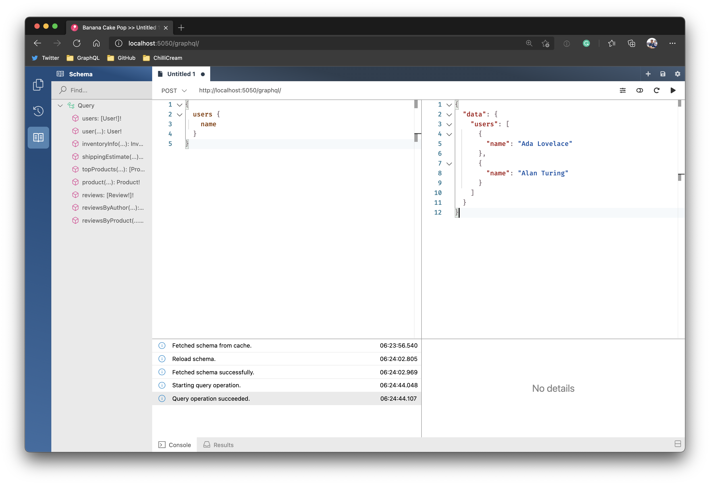
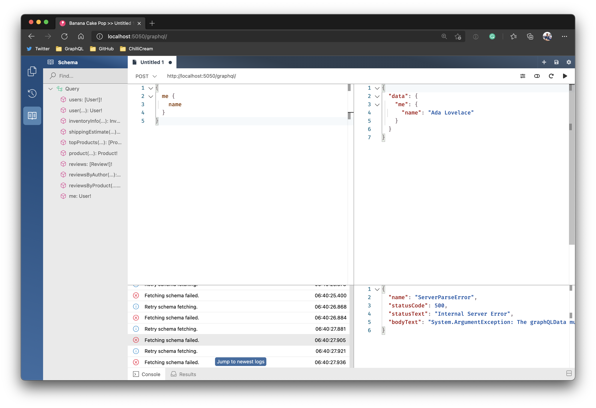
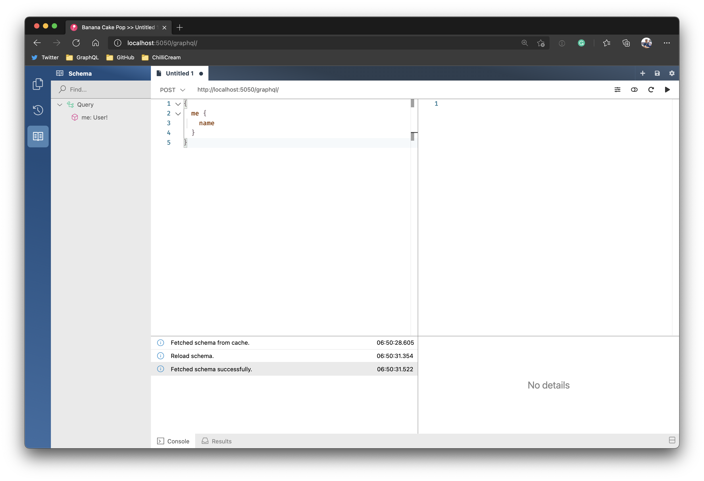
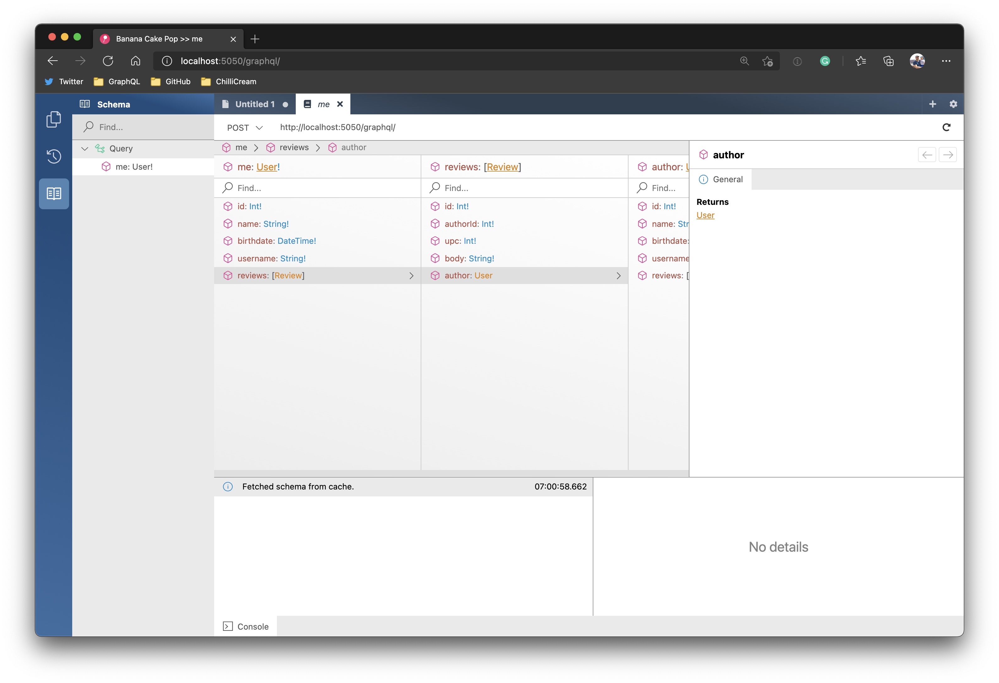
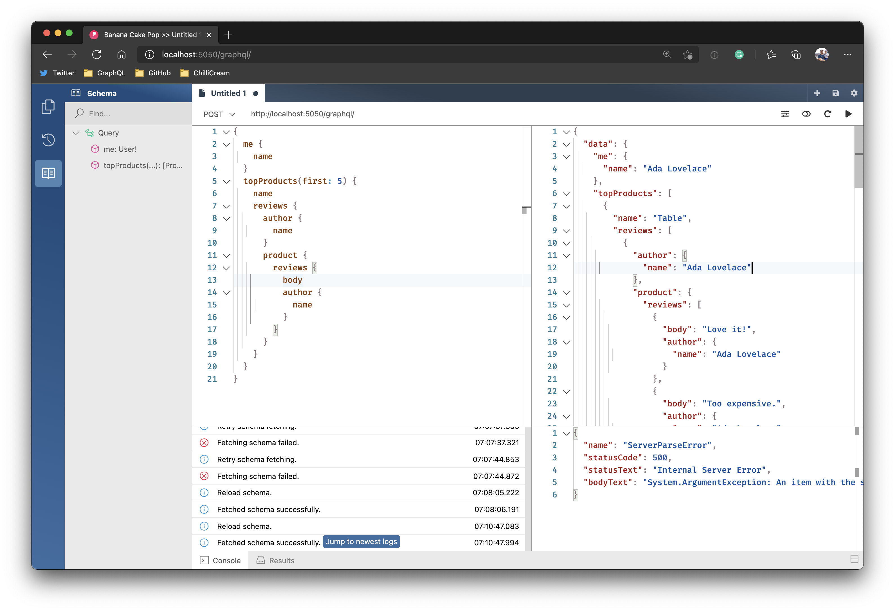

# Create a basic GraphQL gateway

## Create server project

1. Create a new project for our GraphQL gateway.
   1. `dotnet new web -n gateway`
   1. `dotnet sln add gateway`

## Add GraphQL and Stitching

1. Add a reference to the NuGet package package `HotChocolate.AspNetCore` version `11.0.8`.
   1. `dotnet add gateway package HotChocolate.AspNetCore --version 11.0.8`
1. Add a reference to the NuGet package package `HotChocolate.Stitching` version `11.0.8`.
   1. `dotnet add gateway package HotChocolate.Stitching --version 11.0.8`

## Configure basic gateway.

1. Head over to the `Startup.cs` and add the following constants to represent our downstream services.

   ```csharp
   public const string Accounts = "accounts";
   public const string Inventory = "inventory";
   public const string Products = "products";
   public const string Reviews = "reviews";
   ```

1. Next, we need to configure HTTP connections for each downstream service.

   ```csharp
   public void ConfigureServices(IServiceCollection services)
   {
      services.AddHttpClient(Accounts, c => c.BaseAddress = new Uri("http://localhost:5051/graphql"));
      services.AddHttpClient(Inventory, c => c.BaseAddress = new Uri("http://localhost:5052/graphql"));
      services.AddHttpClient(Products, c => c.BaseAddress = new Uri("http://localhost:5053/graphql"));
      services.AddHttpClient(Reviews, c => c.BaseAddress = new Uri("http://localhost:5054/graphql"));
   }
   ```

1. Last, we need to add the GraphQL server configuration.

   ```csharp
   public void ConfigureServices(IServiceCollection services)
   {
      services.AddHttpClient(Accounts, c => c.BaseAddress = new Uri("http://localhost:5051/graphql"));
      services.AddHttpClient(Inventory, c => c.BaseAddress = new Uri("http://localhost:5052/graphql"));
      services.AddHttpClient(Products, c => c.BaseAddress = new Uri("http://localhost:5053/graphql"));
      services.AddHttpClient(Reviews, c => c.BaseAddress = new Uri("http://localhost:5054/graphql"));

      services
         .AddGraphQLServer()
         .AddRemoteSchema(Accounts)
         .AddRemoteSchema(Inventory)
         .AddRemoteSchema(Products)
         .AddRemoteSchema(Reviews);
   }
   ```

## Add routing for the GraphQL gateway

To run queries against our very basic GraphQL gateway, we need to add some routing configuration. For this, we stay in the `Startup.cs` and will need to rewrite the `Configure` method a bit.

1. Replace `app.UseEndpoints(endpoints => ...` with the following configuration:

   ```csharp
   app.UseEndpoints(endpoints =>
   {
      endpoints.MapGraphQL();
   });
   ```

1. Further, we need to update out tye configuration so we can run our gateway. Append the following to the tye.yaml.

   ```yaml
   - name: gateway
     project: gateway/Gateway.csproj
     bindings:
       - port: 5050
   ```

## Test the gateway

1. Restore the dotnet tools.
   1. dotnet tool restore
1. Run tye to start the gateway and its downstream services.
   1. dotnet tye run --watch
1. Open a browser and go to `http://localhost:5050/graphql`

   

# Rewrite Schemas

To create a schema that reflects our business model, we need to rewrite the downstream services into a new schema that integrates the services' types with each other.

## Add schema configuration

1. Create a new file called `Stitching.graphql` which shall be located at the root of the gateway project.

1. Add the following GraphQL SDL snippet into the `Stitching.graphql` file.

   ```graphql
   extend type Query {
     me: User! @delegate(schema: "accounts", path: "user(id: 1)")
   }
   ```

   > This piece of GraphQL will extend the current root type and delegate calls it to the `Query` type of the schema `accounts` and, more specifically, to the field `user`.

1. Go to your `gateway.csproj` and add the following to an `ItemGroup` so that changes to the `Stitching.graphql` file are tracked.

   ```xml
   <ItemGroup>
     <Watch Include="Stitching.graphql" />
   </ItemGroup>
   ```

1. Head over to the gateway `Startup.cs` and add `.AddTypeExtensionsFromFile("./Stitching.graphql")` to our GraphQL server configuration.

   ```csharp
   services
      .AddGraphQLServer()
      .AddRemoteSchema(Accounts)
      .AddRemoteSchema(Inventory)
      .AddRemoteSchema(Products)
      .AddRemoteSchema(Reviews)
      .AddTypeExtensionsFromFile("./Stitching.graphql");
   ```

1. Head over to your browser and reload your schema to review the changes. We now can see our new field. Try to write a query against this new field.

   

## Build out the schema

We now have an idea of how we really can rewrite our schemas to an entirely new schema. In this section, we will fully transform our schemas to reflect our business needs.

1. Remove the noise by removing the auto-stitched root fields.

   ```csharp
   services
      .AddGraphQLServer()
      .AddRemoteSchema(Accounts, ignoreRootTypes: true)
      .AddRemoteSchema(Inventory, ignoreRootTypes: true)
      .AddRemoteSchema(Products, ignoreRootTypes: true)
      .AddRemoteSchema(Reviews, ignoreRootTypes: true)
      .AddTypeExtensionsFromFile("./Stitching.graphql");
   ```

> The above configuration will now ignore any root types from the downstream services `ignoreRootTypes: true`.

1. Next we need to introduce a new empty `Query` type on the gateway that we can use to extend `.AddQueryType(d => d.Name("Query"))`.

   ```csharp
   services
      .AddGraphQLServer()
      .AddQueryType(d => d.Name("Query"))
      .AddRemoteSchema(Accounts, ignoreRootTypes: true)
      .AddRemoteSchema(Inventory, ignoreRootTypes: true)
      .AddRemoteSchema(Products, ignoreRootTypes: true)
      .AddRemoteSchema(Reviews, ignoreRootTypes: true)
      .AddTypeExtensionsFromFile("./Stitching.graphql");
   ```

1. Head over to your browser and reload your schema to review the changes.

   

1. Integrate the reviews with the user by extending the `User` type. For this, place the following piece of GraphQL SDL into your `Stitching.graphql`.

   ```graphql
   extend type User {
     reviews: [Review]
       @delegate(schema: "reviews", path: "reviewsByAuthor(authorId: $fields:id)")
   }
   ```

1. Next, let us do this from the other side by integrating the user with the reviews.

   ```graphql
   extend type Review {
     author: User @delegate(schema: "accounts", path: "user(id: $fields:authorId)")
   }
   ```

1. Head over to your browser and reload your schema to review the changes.

   

1. Now, let us introduce top-level access to our products by adding the following snippet to the `Query` type in `Stitching.graphql`.

   ```graphql
   extend type Query {
     me: User! @delegate(schema: "accounts", path: "user(id: 1)")
     topProducts(first: Int): [Product] @delegate(schema: "products")
   }
   ```

1. Again, we want to fully integrate those entities with the entities that we already have. We now integrate the product with the review by adding the following snippet to our `Review` type in `Stitching.graphql`.

   ```graphql
   extend type Review {
     author: User @delegate(schema: "accounts", path: "user(id: $fields:authorId)")
     product: Product
       @delegate(schema: "products", path: "product(upc: $fields:upc)")
   }
   ```

1. The same we want to do from the other side by adding a field to products that return all the reviews we have for a given product.

   ```graphql
   extend type Product {
     reviews: [Review]
       @delegate(schema: "reviews", path: "reviewsByProduct(upc: $fields:upc)")
   }
   ```

1. Head over to your browser and reload your schema to review the changes.

   

1. We also want to integrate the stock and shipping information into our product. The inventory info is not an object that we want to integrate into our schema. We only want to grab one specific field from it. For this, we will do a deep stitch. Add the following snippet to your `Product` type in the `Stitching.graphql`

   ```graphql
   extend type Product {
     reviews: [Review]
       @delegate(schema: "reviews", path: "reviewsByProduct(upc: $fields:upc)")
     inStock: Boolean
       @delegate(
         schema: "inventory"
         path: "inventoryInfo(upc: $fields:upc).isInStock"
       )
   }
   ```

1. Last, let us integrate the shipping estimates by adding the following snippet to your `Product` type in the `Stitching.graphql`.

   ```graphql
   extend type Product {
     reviews: [Review]
       @delegate(schema: "reviews", path: "reviewsByProduct(upc: $fields:upc)")
     inStock: Boolean
       @delegate(
         schema: "inventory"
         path: "inventoryInfo(upc: $fields:upc).isInStock"
       )
     shippingEstimate: Int
       @delegate(
         schema: "inventory"
         path: "shippingEstimate(price: $fields:price weight: $fields:weight)"
       )
   }
   ```

1. Head over to your browser and reload your schema to review the changes.

   